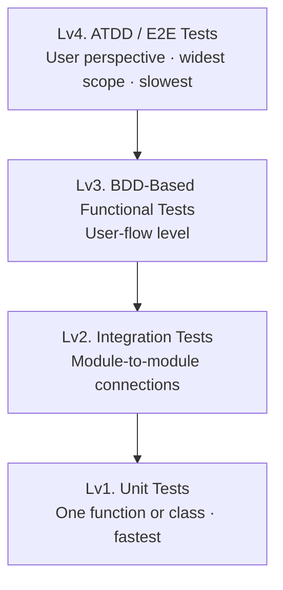
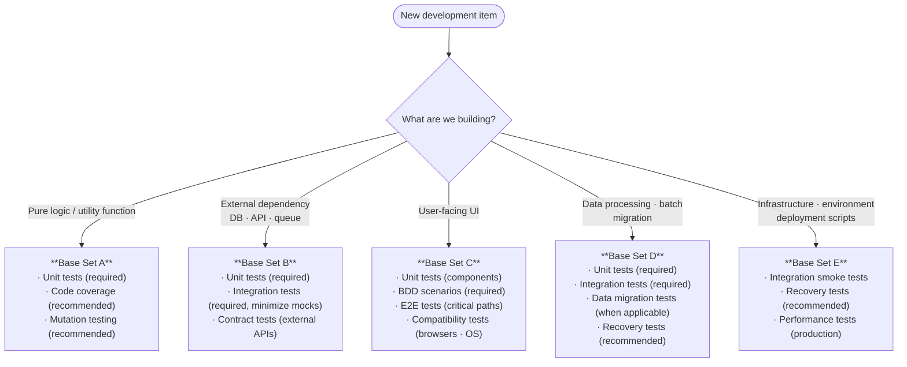
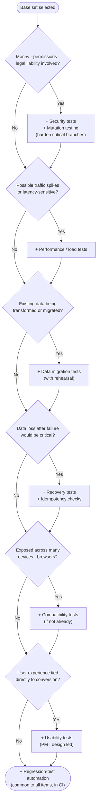
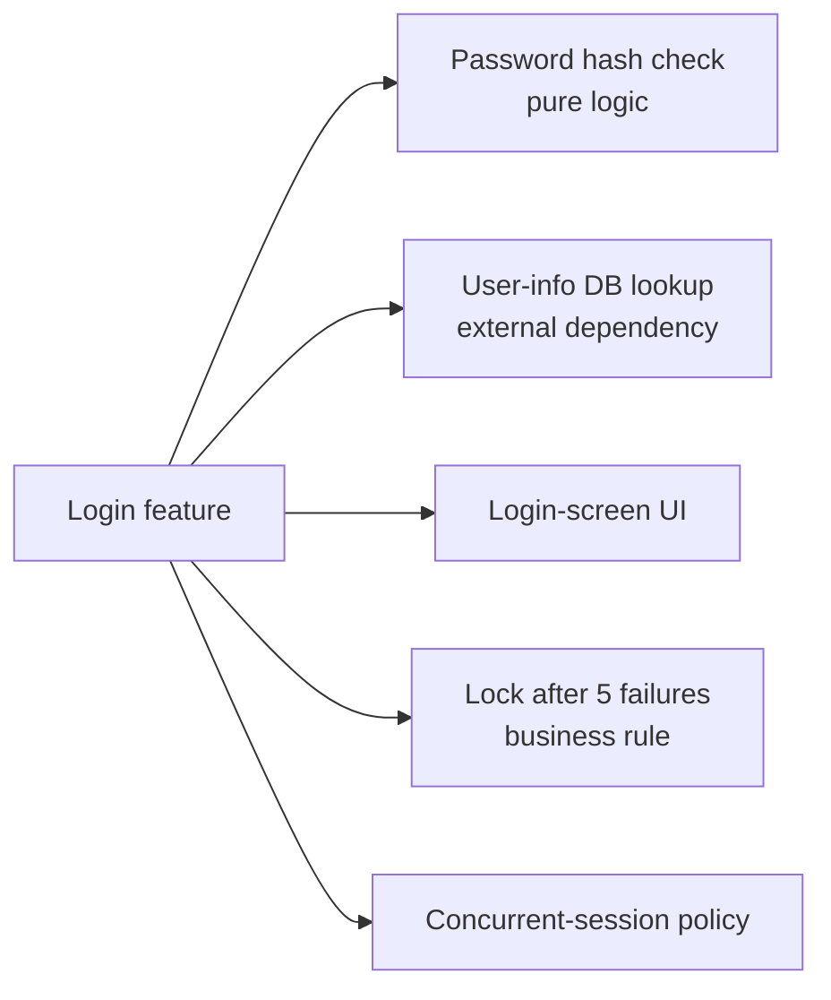

# TDD Standard Document

## 0. Before You Start

### What Is TDD?

**TDD (Test-Driven Development)** is a development practice in which you write the test *before* the production code. You first define the "exam question" (the test) that the code must pass, then write only the minimum code needed to pass it.

### The Red-Green-Refactor Cycle

The heart of TDD is repeating these three short steps:

1. **Red (fail)**: Write a test for a behavior that does not exist yet. It naturally fails.
2. **Green (pass)**: Write the simplest code that makes the test pass. Just make it work.
3. **Refactor (clean up)**: Improve the code (deduplication, readability) while keeping behavior unchanged.

### Document Map

This document covers four areas:

- **Chapter 1. The Four-Stage Test Pyramid** — Unit → Integration → Functional (BDD) → Acceptance / E2E (ATDD), each verifying a wider scope.
- **Chapter 2. Test-Type Reference Guide** — code coverage, mutation, regression, performance, security, and other test types described at equal depth.
- **Chapter 3. Which Tests Does This Item Need? — A Decision Methodology** — a thinking framework that answers *"what do I apply to the feature I'm building right now?"*
- **Chapter 4. Summary Matrix** — leadership roles and checklists at a glance.

---

## Chapter 1. The Four-Stage Test Pyramid

Tests divide into four stages by verification scope. Lower stages are narrow and fast; higher stages are broad and slow.

### Stage 1: Unit Test — *"Is the logic correct?"*

The lowest level: verify the smallest unit of code (a single function, a single class). The Red-Green-Refactor cycle of TDD lives here.

**Design points:**

- **Happy Path**: Does normal input produce the expected output?
  - Example: does `add(2, 3)` return `5`?
- **Edge Case**: Inputs at the boundary (0, negative, max value) and special inputs (null, empty string).
  - Example: `divide(10, 0)` (division by zero).
- **Error Handling**: Does the code throw the intended exception when given bad input?
  - Example: passing a string where a number is required throws `IllegalArgumentException`.

**Sufficiency check:** Use a code coverage tool to confirm that tests exercise every branch of `if`, `switch`, and similar control flow.

---

### Stage 2: Integration Test — *"Do the connections work?"*

Verifies that two or more modules — or external systems like a database or third-party API — work correctly when **actually connected**. If unit tests examine "one part," integration tests examine "the parts assembled together."

**Design points:**

- **Persistence**: Does data save/read/update/delete in the DB as intended?
- **Contract**: Does the format and protocol used to exchange data with external services (payment APIs, auth servers) match?

**Sufficiency check:** Avoid **mocks** (fake stand-ins for external systems) where possible. Run against an environment that resembles production so the data flow is verified end to end.

---

### Stage 3: Functional Test (BDD-Based) — *"Does it behave the way the user wants?"*

Verifies system *behavior* from a user-story perspective using BDD's **Given-When-Then** structure.

#### What Is BDD (Behavior-Driven Development)?

BDD is derived from TDD and focuses on **user behavior**. Instead of *"what should I test?"* it asks *"how should this system behave?"*

The core grammar is a near-natural-language three-part structure:

- **Given (precondition)**: a state or environment.
  - Example: the user has 3 items in the cart.
- **When (action)**: an action is taken.
  - Example: the user clicks the checkout button.
- **Then (outcome)**: an outcome must follow.
  - Example: the order-complete page is shown.

**Property:** the test code itself becomes **living documentation**. Non-developers (product managers, QA) can read it and immediately understand what is being verified.

**Representative tools:** Cucumber, SpecFlow, JBehave.

#### Design points

- **Scenario-driven**: verify in **user-flow** units, e.g., *"after the user signs in and adds a cart item, the total must auto-update."*
- **State change**: confirm that the system state changes correctly per business rules after the action.

**Sufficiency check:** confirm that every **acceptance criterion** ("conditions that mean this feature is done") in the spec has been translated into a test case.

---

### Stage 4: Acceptance / E2E Test (ATDD-Based) — *"Does the whole process complete?"*

Drives the entire process from start to finish through a real browser or app UI, exactly as a user would. **E2E (End-to-End)**, as the name suggests, means front-to-back.

#### What Is ATDD (Acceptance Test-Driven Development)?

ATDD starts **before development begins**: users, product managers, developers, and QA gather to answer this question:

> "What is the criterion (acceptance criterion) by which we'll declare this feature 'done'?"

**Core goal:** everyone on the team understands the requirement identically — a Single Source of Truth.

**Properties:**

- **Collaborative**: not a technical unit test but a business-perspective test such as *"on successful login, the user lands on the main page."*
- **Process**: discuss requirements → write the acceptance test → confirm it fails → implement with TDD → acceptance test passes (= done).
- **Benefit**: removes spec ambiguity up front and prevents the *"this isn't what I asked for"* failure mode at delivery.

#### Design points

- **Critical Path**: design first for the most important paths (sign-up → order → payment).
- **Environment validation**: final confirmation that the system works under production-equivalent network and configuration.

**Sufficiency check:** verify the **business "success" criteria** — not just technical metrics.

---

## Chapter 2. Test-Type Reference Guide

Chapter 1 covered *"at what scope a test runs."* This chapter walks through **individual test types** at equal depth. Every entry follows this format:

> **Concept** → **Core question** → **Why it matters** → **Where applied** → **Examples / checks** → **(Representative tools)**

### 2-0. Per-Stage Sufficiency Check Questions (At a Glance)

A fast checklist for whether each pyramid stage is sufficiently verified.

| Stage | Diagnostic question |
|---|---|
| Unit | Is every conditional and exception path tested? |
| Integration | Do external interfaces (DB, APIs) operate without errors? |
| Functional (BDD) | Does the system respond the way users expect to behave? |
| Acceptance (ATDD) | Are all business goals stated in the spec achieved? |

---

### 2-1. Code Coverage

**Concept:** A metric that measures the percentage of source code actually executed during tests. Variants include line coverage, branch coverage, and condition coverage.

**Core question:** *"How much of the code did my tests touch?"*

**Why it matters:** Writing 100 tests doesn't help if they all hit the same code path. Coverage shows you a **map of where you haven't been**.

**Where applied:** Primarily unit and integration tests. Recently teams also measure E2E coverage to ask *"running our scenario tests, what percentage of the codebase do we actually touch?"* — a useful signal for missing scenarios.

**Example:** for `if (age >= 18) ... else ...`, testing only the `>= 18` branch shows 50% branch coverage.

**Caution:** 100% coverage does **not** mean bug-free. Tests that *execute* code without *asserting* on its result still inflate coverage. That is why mutation testing (2-2) is a complement.

**Representative tools:** JaCoCo (Java), Istanbul/nyc (JavaScript), coverage.py (Python).

---

### 2-2. Mutation Testing

**Concept:** Deliberately tweak the source code (e.g., change `>` to `>=`, `+` to `-`, `true` to `false`) and rerun the tests. If the tests still pass, the suite is *not strict enough at that location*. Mutation testing measures the **rigor** of your tests.

**Core question:** *"Are my tests actually strict enough to catch a behavioral change?"*

**Why it matters:** Even at 100% line coverage, weak assertions miss bugs. Mutation testing measures the **real strength** of the test suite.

**Where applied:** Primarily unit tests. Running it against integration or E2E suites is too slow and too hard to attribute root cause.

**Example:** in `return a > b ? a : b`, mutating `>` to `<` should break a test. If nothing fails, you have no assertion proving "the larger value is returned."

**Representative tools:** PIT (Java), Stryker (JavaScript/TypeScript/.NET), mutmut (Python).

---

### 2-3. Edge Case & Boundary Testing

**Concept:** Deliberately pick inputs at the **boundary** of the valid range and just beyond — and unusual conditions. Less a tool and more a **philosophy of test data design**.

**Core question:** *"How does the system behave at the edge of its valid range?"*

**Why it matters:** Most bugs live at the edges. `0`, negatives, `max + 1`, empty input, simultaneous events — these are the danger zones.

**Where applied:** Every stage — unit, integration, BDD, and ATDD.

**Examples by stage:**

- **Unit**: what does an age-calculation function do with `-1` or `0`?
- **Integration**: if a DB column maxes at 255 chars, what happens with strings of exactly 255 / 256 characters via the API?
- **BDD**: when the cart is empty and the user clicks checkout, what message appears?
- **ATDD (product perspective)**: in a "first 100 users" event, what message does the 101st user see? *(Critical for product managers.)*

**Tip for product managers:** when defining acceptance criteria, don't write only the happy path — also state *"how the system should behave at the boundary."* Otherwise the ATDD stage will leave gaps.

---

### 2-4. Regression Testing ★

**Concept:** After adding a feature or fixing a bug, verify that **previously working behavior still works**. The act of running every accumulated test together.

**Core question:** *"I added the new thing — did it break the old things?"*

**Why it matters:** Code is interconnected; one change easily breaks another module. No human can manually re-test every feature on every change. Automated regression tests are the safety net.

**Relationship to TDD:** **The endgame of TDD is essentially regression-test automation.** Practicing TDD steadily produces a deep regression-test pool as a natural side-effect.

**Where applied:** All unit, integration, and E2E tests combine into the regression suite. Typically run automatically by CI/CD on every push.

**Example:** refactoring the payment module accidentally breaks sign-up — the sign-up regression test catches it immediately on the next CI run.

**Representative tools:** Jenkins, GitHub Actions, GitLab CI bundle and run all tests automatically.

---

### 2-5. Performance / Load Testing

**Concept:** Measure how much load the system can withstand and how fast it responds. Covers steady-state performance and sudden surges (load / stress).

**Core question:** *"If 10,000 users show up at once, will the system hold? Will response times degrade?"*

**Why it matters:** Even if every feature works, a 10-second response will lose users. Traffic spikes (flash sales, course registration) almost always become outages without prior validation.

**Where applied:** Integration or E2E stage in a production-like staging environment. Usually the last gate before release.

**Sample metrics:**

- **TPS** (Transactions Per Second)
- Mean / 95th-percentile response time
- Concurrent users
- Error rate
- Resource usage (CPU, memory, DB connections)

**Representative tools:** JMeter, k6, Gatling, Locust.

---

### 2-6. Security Testing

**Concept:** Find places where unauthorized users can reach data or where external attacks could exploit the system.

**Core question:** *"Is there a hole through which an attacker can abuse the system or steal data?"*

**Representative checks:**

- **Authentication / authorization**: can an unauthenticated user reach protected pages? Can a regular user call an admin API?
- **SQL Injection**: can mixing SQL into input expose or corrupt the DB?
- **XSS (Cross-Site Scripting)**: can a `<script>` tag in input run in another user's browser?
- **CSRF (Cross-Site Request Forgery)**: can another site trick a user into sending an unintended request?
- **Sensitive-info leakage**: do logs, error messages, or URLs expose passwords, tokens, or PII?

**Where applied:** Multi-stage — from unit tests of authorization functions to E2E vulnerability scans.

**Representative tools:** OWASP ZAP, Burp Suite, SonarQube (static analysis).

---

### 2-7. Usability Testing

**Concept:** Verify that real users can understand and use the interface intuitively, without friction. *Driven by product managers and designers.*

**Core question:** *"Without a manual, can the user complete the task they came to do?"*

**Why it matters:** Even fully working features lose users when buttons are confusing or messages ambiguous. This is an area automation cannot capture, so dedicated validation is required.

**Methods:**

- Recruit 5–7 real users, give them tasks, watch their behavior and reactions on screen.
- A/B test: randomly serve two designs and compare conversion / drop-off.
- Heuristic evaluation: UX experts walk a checklist (e.g., Nielsen's 10 Principles).

**Where applied:** From planning and design through post-launch — continuously.

---

### 2-8. Compatibility Testing

**Concept:** Confirm UI does not break and features still work across various browsers, OSes, devices, and resolutions.

**Core question:** *"Does my screen render correctly on Safari, on a Galaxy Fold, and on lingering legacy browsers?"*

**Coverage axes:**

- **Browsers**: Chrome, Safari, Firefox, Edge — current and prior versions.
- **OSes**: latest N versions of iOS, Android; Windows, macOS.
- **Resolutions / devices**: desktop (1920×1080), tablet, mobile (360×640), foldables.
- **Network conditions**: Wi-Fi, 3G/LTE/5G, throttled networks.

**Where applied:** Mainly the E2E stage. At the design-system level, visual regression testing is a frequent companion.

**Representative tools:** BrowserStack, Sauce Labs, Playwright (multi-browser automation), Percy (visual regression).

---

### 2-9. Data Migration Testing

**Concept:** When moving data from an old system to a new one (or to a new schema), verify that there is no **loss, mutation, duplication, or encoding corruption**.

**Core question:** *"Is the data semantically identical before and after migration? Did anything disappear or warp?"*

**Why it matters:** Once-bad migrated data is nearly impossible to recover after the new system goes live. Migration is typically a *one-shot* operation, so prior validation is decisive.

**Checks:**

- **Row counts**: does N before exactly equal N after?
- **Critical field values**: checksum / hash / sample comparison.
- **Encoding conversion**: any breakage of non-ASCII, emoji, special characters? (e.g., EUC-KR → UTF-8.)
- **Foreign-key integrity**: are parent/child relationships preserved?
- **Dates / timezones**: KST↔UTC conversions correct?

**Where applied:** Special moments — system replacement, schema change, service mergers. Run as a rehearsal before the real cutover.

---

### 2-10. Recovery Testing

**Concept:** When emergencies (server crash, network drop, disk failure) occur, verify the system **recovers safely with no data loss**.

**Core question:** *"After an outage and recovery, what happens to in-flight user work and data?"*

**Scenarios:**

- DB down then restarted: do in-flight transactions roll back consistently?
- API server forcibly killed: does the client retry appropriately or notify the user clearly?
- Brief network drop: does payment double-charge or vanish? (idempotency check)
- Backup → restore validation: can the system be *actually restored* from the backup file? (Storing backups is meaningless if they cannot restore.)

**Where applied:** Integration / E2E, or a dedicated chaos-engineering environment.

**Representative practice:** Chaos Engineering — Netflix's Chaos Monkey deliberately kills production components on a schedule to continuously validate resilience.

---

## Chapter 3. Which Tests Does This Item Need? — A Decision Methodology

*"I understand the test types, but what do I apply to the feature I'm building right now?"* — this chapter is the thinking framework for that question.

### 3-1. Core Principle — Risk-Based Thinking

Applying every kind of test to every line of code is **infeasible and inefficient**. The single criterion for spending limited time and money is **risk**.

> **Risk = Impact (when failure happens) × Probability (of failure)**

Higher risk → more stages and stricter sufficiency checks. Low-risk items (e.g., a throwaway internal admin screen) may be fine with only minimal unit tests.

### 3-2. Four Decision Axes

Classify each item along these four axes:

| Axis | Question | Effect |
|---|---|---|
| **① Item nature** | Pure logic / external dependency / UI / data processing / infrastructure — which is it? | Determines which tests are *technically* possible |
| **② Change frequency** | Will this code change often? | The more it changes, the higher the value of regression tests |
| **③ Failure impact** | If it breaks, who is harmed and how much? (users / revenue / legal) | Higher impact ⇒ multi-stage validation is mandatory |
| **④ Reproducibility / recovery** | Can damage be undone after an incident? | Unrecoverable areas (data migration, payments) need heavy *prior* validation |

### 3-3. Decision Tree — Step 1: Base Test Set by Item Nature

First classify the item by *"what are we building?"* and pick the **base test set**.

### 3-4. Decision Tree — Step 2: Augment by Risk Factors

Once the base set is picked, walk through risk questions and **add tests** for each "yes." Questions are independent: every "yes" adds, then proceeds to the next question.

### 3-5. Recommended Test Matrix by Item Type

A quick lookup of *required / recommended / optional* tests per common item type. Use it to cross-check decision-tree results.

| Item type | Unit | Integration | BDD | E2E/ATDD | Performance | Security | Compatibility | Regression | Special |
|---|---|---|---|---|---|---|---|---|---|
| Pure compute / utility function | ● Required | — | — | — | — | — | — | ● | Mutation recommended |
| DB CRUD API | ● | ● Required | ● | △ | △ | △ | — | ● | Boundary |
| External API integration | ● | ● Required | ● | △ | △ | △ | — | ● | Contract |
| User-facing screen (general) | ● | ● | ● Required | ● Required | △ | △ | ● Recommended | ● | Usability |
| Payment / order flow | ● | ● | ● | ● Required | ● Required | ● Required | ● | ● | Recovery · idempotency |
| Login / authorization | ● | ● | ● | ● | △ | ● Required | △ | ● | — |
| Search / high-traffic page | ● | ● | ● | ● | ● Required | △ | ● | ● | — |
| Data-migration script | ● | ● Required | — | — | △ | — | — | △ | Migration · recovery required |
| Batch / scheduled jobs | ● | ● | — | △ | △ | — | — | ● | Recovery |
| Internal admin screen | ● | △ | △ | △ | — | ● | — | ● | — |

> **Legend** — ● required/recommended · △ situational · — generally unnecessary

### 3-6. Case Study — *"Add Login Feature"*

Applying the methodology to a real item.

**1) Decompose the item**

**2) Four-axis analysis**

- ② Change frequency: low (built once, mostly stable)
- ③ Failure impact: **very high** (full-user lockout, info-leak risk)
- ④ Recovery difficulty: leaked credentials are practically unrecoverable
  → **Very high failure impact ⇒ multi-stage validation required.**

**3) Decision-tree result**

| Step 1 (3-3) | Step 2 risk additions (3-4) | Final test set |
|---|---|---|
| External dependency → **Set B** + UI portion → **Set C** | Permissions / legal → **add security & mutation** / many devices → **add compatibility** | Unit + Integration + BDD + E2E + Security + Mutation + Compatibility + Performance + Regression |

**4) Concrete tests**

- **Unit**: hash-check function, lockout counter (Edge: exactly 5 / 6 / 0 attempts)
- **Mutation**: lockout threshold branch — does the test catch `>= 5` mutated to `> 5`?
- **Integration**: DB user lookup, session-token issuance
- **BDD**: scenario *"after 5 wrong-password attempts, the account locks"*
- **E2E**: login screen → main screen full flow
- **Security** ★: SQL injection, plaintext-password leakage, CSRF, brute-force throttling
- **Compatibility**: major mobile and desktop browsers
- **Performance**: login-API response time (hash compute cost)
- **Regression**: bundle all of the above into CI

**5) Tests that are *not* needed**

- Data migration tests (new feature, no data to move).

---

Run **decompose → 4-axis analysis → step-1 decision tree (classify) → step-2 decision tree (risk augmentation) → matrix cross-check** in order, and *"what's missing"* surfaces naturally as empty cells.

---

## Chapter 4. Summary Matrix

A combined table for product managers, developers, and QA — organized by **who leads** and **what is verified**.

| Layer | Test type | Lead role | Verification core (checklist) |
|---|---|---|---|
| Foundation (technical) | Unit / Integration | Developers | Logic correctness, boundaries, code coverage, mutation testing |
| Mid (collaborative) | BDD / functional | PM + dev | Spec scenarios match Given-When-Then |
| Top (business) | ATDD / E2E | PM + QA | End-to-end completion from the user's view |
| Cross-cutting (quality) | Regression | Everyone | "I added the new thing — did it break the old?" |
| Specialty (perf / safety) | Performance / Security / Compatibility | Dev + QA | Speed, concurrency, attack defense, browser parity |
