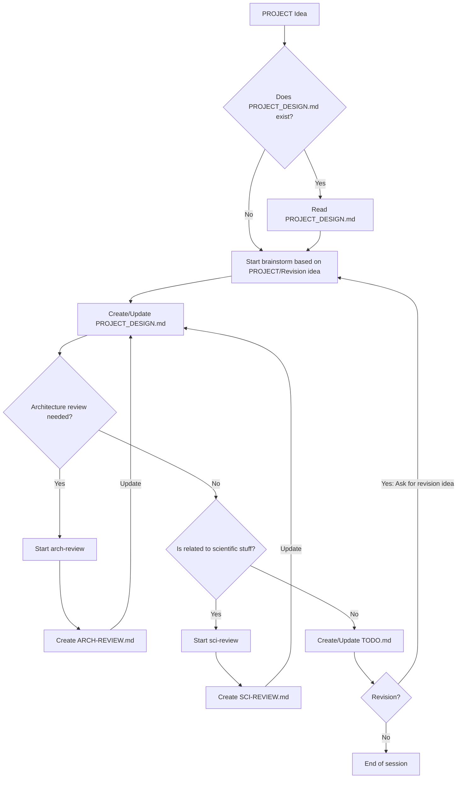
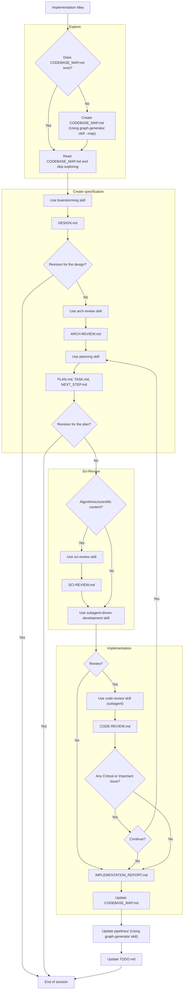
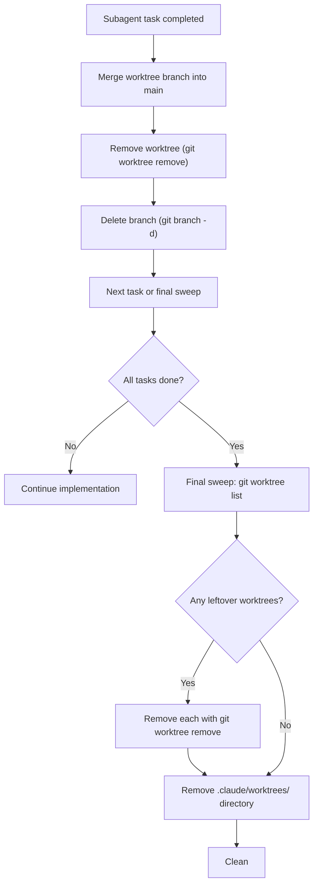

## Workflow

### Project Design Workflow



<caution>
- Ask if you are confused the idea is belong to the `Project Design` or `Implementation`.
- `PROJECT_DESIGN.md` should include full-suite development plan and MVP development plan.
- `TODO.md` should clearify which item is belong to the MVP.
</caution>

### Implementation Workflow



<caution>
- Remove the worktree if it is created for parallel tasks after the implmentation.
</caution>

### Worktree Cleanup Workflow

After each subagent completes work in a worktree, clean up immediately. After all implementation is done, run a final sweep.



**Commands reference:**

```bash
# List all worktrees
git worktree list

# Remove a specific worktree (after merging its branch)
git worktree remove .claude/worktrees/<agent-name>

# Delete the merged branch
git branch -d worktree-agent-<id>

# Final sweep: remove leftover directory
rm -rf .claude/worktrees/
```

<caution>
- Always merge the worktree branch before removing it.
- Always clean up worktrees before ending a session.
- Run `git worktree list` as a final check — only the main working tree should remain.
</caution>
