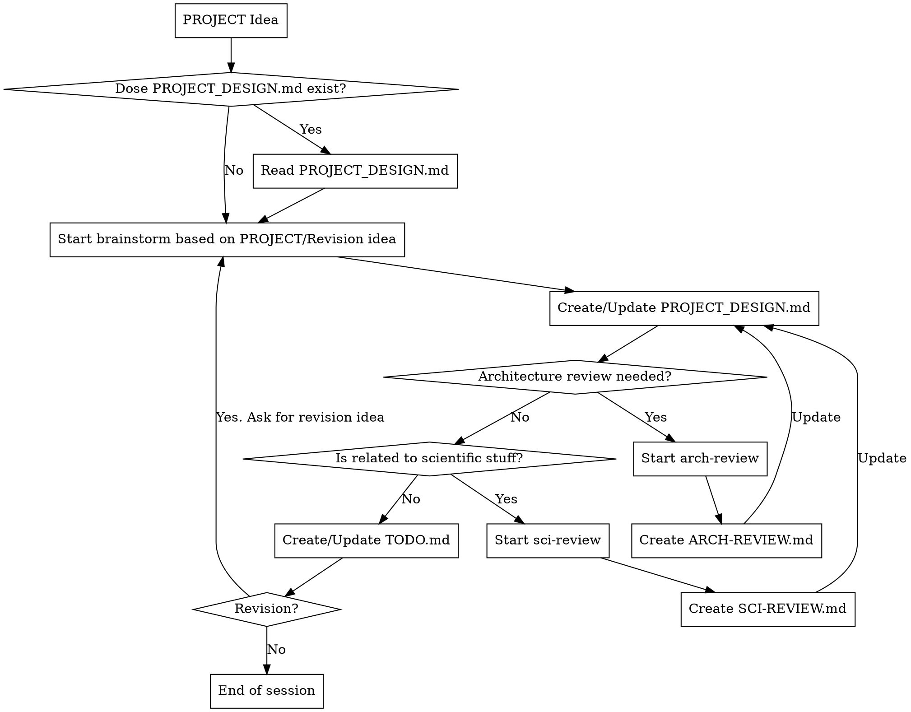
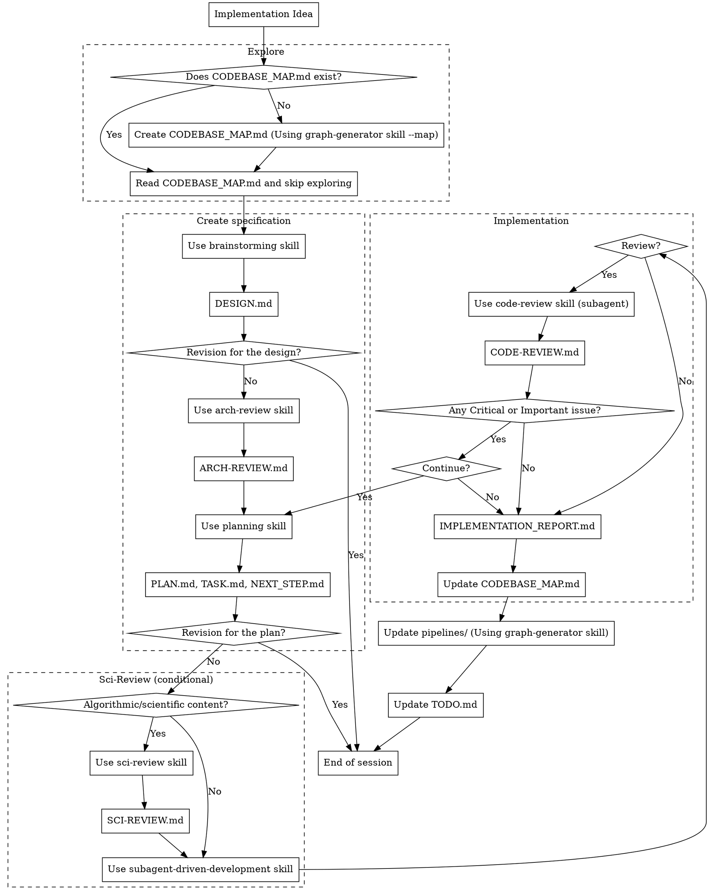

## Workflow

### Project Design Workflow

<caution>
- Ask if you are confused the idea is belong to the `Project Design` or `Implementation`.
- `PROJECT_DESIGN.md` should include full-suite development plan and MVP development plan.
- `TODO.md` should clearify which item is belong to the MVP.
</caution>

### Implementation Workflow

<caution>
- Remove the worktree if it is created for parallel tasks after the implmentation.
</caution>
