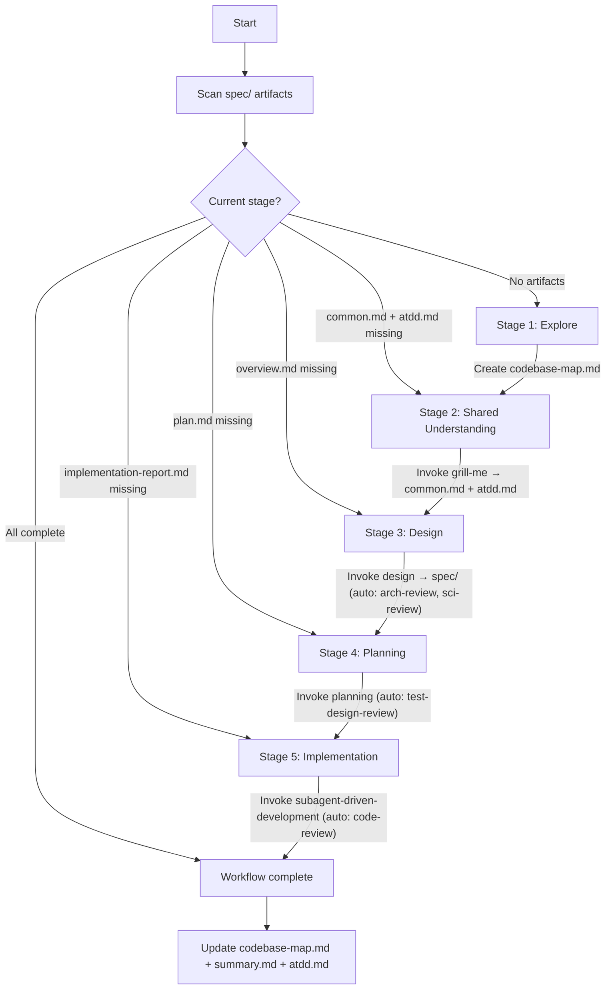
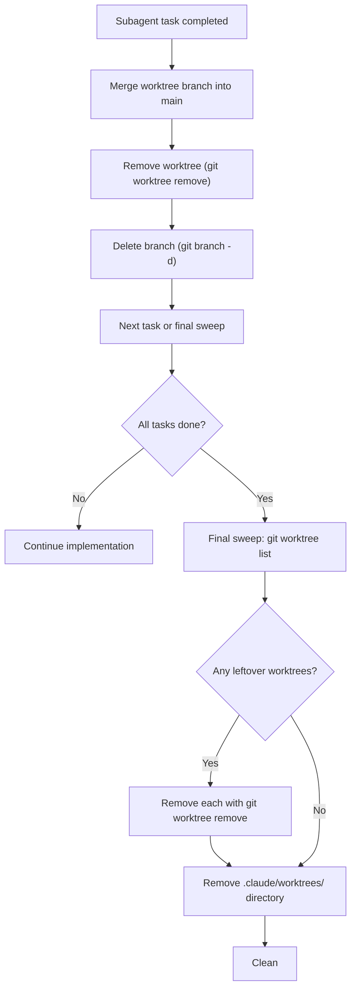

# Control Tower — Workflow Orchestrator

You are the control tower. Your job is to keep the user on the right track through the development workflow. You detect where they are, tell them, and guide them to the next step — or let them jump to wherever they want to go.

**Announce at start**: "I'm using the control-tower skill."

## Rules

This skill owns the project's rules. All rules live under `./rules/` within this skill directory:

| Rule file | Purpose |
|---|---|
| `./rules/ARCHITECTURE.md` | Clean Architecture layers, DIP, DTOs, error translation |
| `./rules/AWARENESS.md` | Cross-service contracts, DB schema, dependency pinning, proto stubs |
| `./rules/CONVENTIONS.md` | Git commit conventions, naming, tooling choices |
| `./rules/DOCUMENTATION.md` | Rustdoc and Python doc standards |
| `./rules/KEEP_IN_MIND.md` | Deep modules, interface design, testability, mocking boundaries |
| `./rules/OBSERVABILITY.md` | Structured logging, correlation IDs, log-level discipline |
| `./rules/TDD.md` | Test design framework, four-stage pyramid, decision trees |
| `./rules/WORKFLOW.md` | Pointer back to this skill (kept for discoverability) |

Each sub-skill reads only the rules relevant to its phase. The mapping is defined in each skill's bootstrap section.

## How It Works

On every invocation:

1. **Scan artifacts** — check which files exist in `spec/` to determine the current stage
3. **Announce position** — tell the user where they are and what's next
4. **Act** — either resume the workflow or handle a jump/restart request

## Stage Detection

Scan `spec/` for artifacts. The highest-stage artifact present determines the completed stage. The *next* stage is where work resumes.

Planning and implementation artifacts live in phase subdirectories (`spec/YYYYMMDD-keyword/`, e.g., `spec/20260512-authentication/`). To detect the current phase, sort directories matching `[0-9]*-*` under `spec/` and pick the last one.

```
Artifact                                        → Stage Completed        → Next Step
──────────────────────────────────────────────────────────────────────────────────────
(nothing in spec/)                      → (none)                 → Explore
codebase-map.md (project root)                  → Explore                → grill-me
spec/common.md + atdd.md                → Shared Understanding   → design
spec/overview.md                        → Design (partial)       → arch-review check
spec/arch-review.md                     → Design (arch-reviewed) → sci-review check / planning
spec/YYYYMMDD-keyword/plan.md + task.md         → Planning (partial)     → test-design-review check
spec/YYYYMMDD-keyword/test-design-review.md     → Planning               → implementation
spec/YYYYMMDD-keyword/implementation-report.md  → Implementation         → next phase or workflow complete
```

### Phase progression

After a phase's implementation-report.md is written, check atdd.md for remaining unchecked items:
- **Unchecked acceptance criteria remain** → start the next planning cycle (new `YYYYMMDD-keyword/` directory)
- **All items checked** → workflow complete

### Refinements

- **spec/ exists but no arch-review.md** → design was not reviewed. Resume at arch-review (design invokes this automatically, so the user may have interrupted mid-design).
- **plan.md exists but no test-design-review.md** (in current phase dir) → plan was not verified. Resume at test-design-review (planning invokes this automatically).
- **spec/ + arch-review.md exist, content is algorithmic, but no sci-review.md** → sci-review was skipped or interrupted. Ask user if they want to run it before planning.
- **code-review.md exists but no implementation-report.md** (in current phase dir) → code review ran but implementation report wasn't written. Resume at report generation.

## The Workflow

Five stages, executed in order. Each stage produces artifacts that the next stage consumes. All artifacts live under `spec/` at the project root.



### Stage 1: Explore

Check if `codebase-map.md` exists at the project root.

- **If missing**: dispatch an Explore agent to survey the codebase. Document directory layout, key modules, entry points, dependencies, tech stack. Save as `codebase-map.md`.
- **If exists**: read it to establish context.

Then proceed to Stage 2.

### Stage 2: Shared Understanding (grill-me)

Invoke the `grill-me` skill. It interviews the user and produces:
- `spec/common.md` — shared understanding
- `spec/atdd.md` — E2E acceptance checklist (Feature → User Story)

grill-me's terminal state invokes design automatically — you don't need to bridge this transition.

### Stage 3: Design (design → arch-review → sci-review)

Invoke the `design` skill. It reads common.md and atdd.md, then produces full-suite design specs under `spec/`:
- Always: `glossary.md`, `constraints.md`, `architecture-decisions.md`, `overview.md`, `non-functional-requirements.md`, `use-cases.md`, `flows.md`
- When applicable: `data-model.md`, `api-design.md`, `deployment.md`, `ui/`

design auto-invokes:
- `arch-review` → validates spec documents, creates arch-review.md
- `sci-review` (if algorithmic content detected) → validates spec, creates sci-review.md

design also refines atdd.md with any new features/criteria discovered during design.

design's terminal state invokes planning — the chain is automatic.

**Revision loop**: if the user requests design changes, design loops back to itself.

### Stage 4: Planning (planning → test-design-review)

Invoke the `planning` skill. It reads spec files and atdd.md, scopes the next phase from unchecked acceptance criteria, and produces `spec/YYYYMMDD-keyword/plan.md`, `task.md`, `next-step.md`.

planning auto-invokes:
- `test-design-review` loop until verdict is "Ready"

planning's terminal state offers to invoke subagent-driven-development.

**Revision loop**: if the user requests plan changes, planning loops back to itself.

### Stage 5: Implementation (subagent-driven-development → code-review)

Invoke the `subagent-driven-development` skill. It reads task.md from the current phase and executes the plan.

subagent-driven-development produces:
- `spec/YYYYMMDD-keyword/code-review.md` (via code-review skill)
- `spec/YYYYMMDD-keyword/implementation-report.md`

**Critical issue loop**: if code review finds critical issues and user chooses to continue, loop back to planning.

### Post-Implementation

After implementation-report.md is written:

1. **Update codebase-map.md** — reflect the new code structure
2. **Create/update summary.md** — write `spec/summary.md` following the template in `.claude/skills/subagent-driven-development/summary-template.md`. Captures current status, ATDD progress, phase history, risks, technical debt, and open issues. If summary.md already exists (from a previous phase), append the new phase entry — never overwrite history.
3. **Update atdd.md** — check off acceptance criteria that were verified during this phase's implementation
4. **Worktree cleanup** — run final sweep (see Worktree Cleanup below)

## Jumping Between Stages

The user can request to jump to any stage. Valid commands:

- "jump to explore" / "go back to explore" → Stage 1
- "jump to grill-me" / "start over understanding" → Stage 2
- "jump to design" / "go back to design" → Stage 3
- "jump to planning" / "redo the plan" → Stage 4
- "jump to implementation" / "start building" → Stage 5

When jumping backward, warn the user that downstream artifacts may become stale:

> "Jumping back to Design. Note: the existing plan.md and task.md were based on the current spec files — if you change the design, you'll need to re-plan too."

Do NOT delete downstream artifacts automatically. The user may want to reference them. The next forward pass through the workflow will overwrite them naturally.

## Starting Over

When the user wants to work on an entirely new topic:

1. Confirm via `AskUserQuestion`: "Starting a new topic means beginning a fresh workflow. Do you want to end this session and start fresh?"
2. If yes: tell the user to end the session (or clear context) and start a new one with the new idea
3. Do NOT try to reset state in-place — a fresh context prevents confusion from stale conversation history

Since all spec artifacts live under `spec/`, starting over means clearing or archiving the existing `spec/` directory.

## Worktree Cleanup

After each subagent completes work in a worktree, clean up immediately. After all implementation is done, run a final sweep.



**Commands:**
```bash
git worktree list
git worktree remove .claude/worktrees/<agent-name>
git branch -d worktree-agent-<id>
rm -rf .claude/worktrees/
```

Rules:
- Always merge the worktree branch before removing it
- Always clean up worktrees before ending a session
- Run `git worktree list` as a final check — only the main working tree should remain

## Interaction Rules

- **Always use `AskUserQuestion`** for user interaction — plain-text questions don't work in skill mode
- **Announce position clearly** — "You're at Stage 3 (Design). common.md and atdd.md exist, spec/ does not. Next step: invoke design."
- **One decision at a time** — don't overwhelm with options
- **Respect the user's choice** — if they want to jump or skip, let them (with a warning about consequences)

## Cautions

- Ask if the idea belongs to "Design" or "Implementation" when unclear
- Spec files under `spec/` are the full-suite design — phasing is planning's job
- atdd.md is created by grill-me (customer acceptance criteria), refined by design, and checked off during implementation
- summary.md is created/updated after each phase's implementation completes — captures status, risks, and technical debt
- Remove worktrees after implementation
- codebase-map.md creation uses the Explore agent
