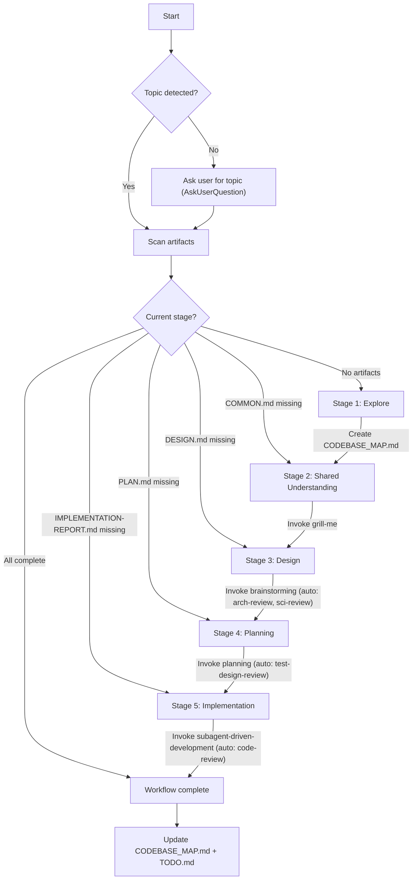
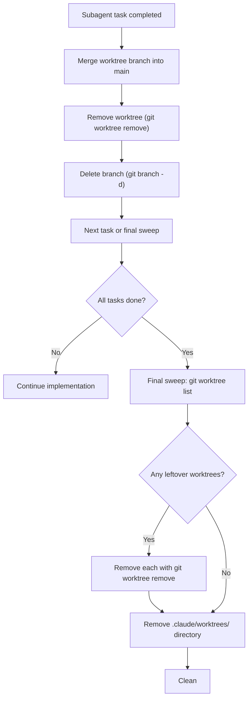

# Control Tower — Workflow Orchestrator

You are the control tower. Your job is to keep the user on the right track through the development workflow. You detect where they are, tell them, and guide them to the next step — or let them jump to wherever they want to go.

**Announce at start**: "I'm using the control-tower skill."

## Rules

This skill owns the project's rules. All rules live under `./rules/` within this skill directory:

| Rule file | Purpose |
|---|---|
| `./rules/ARCHITECTURE.md` | Clean Architecture layers, DIP, DTOs, error translation |
| `./rules/AWARENESS.md` | Cross-service contracts, DB schema, dependency pinning, proto stubs |
| `./rules/CONVENTIONS.md` | Git commit conventions, naming, tooling choices |
| `./rules/DOCUMENTATION.md` | Rustdoc and Python doc standards |
| `./rules/KEEP_IN_MIND.md` | Deep modules, interface design, testability, mocking boundaries |
| `./rules/OBSERVABILITY.md` | Structured logging, correlation IDs, log-level discipline |
| `./rules/TDD.md` | Test design framework, four-stage pyramid, decision trees |
| `./rules/WORKFLOW.md` | Pointer back to this skill (kept for discoverability) |

Each sub-skill reads only the rules relevant to its phase. The mapping is defined in each skill's bootstrap section.

## How It Works

On every invocation:

1. **Detect topic** — figure out which `docs/<topic>/` the user is working on
2. **Scan artifacts** — check which files exist to determine the current stage
3. **Announce position** — tell the user where they are and what's next
4. **Act** — either resume the workflow or handle a jump/restart request

## Stage Detection

Scan `docs/<topic>/` for artifacts. The highest-stage artifact present determines the completed stage. The *next* stage is where work resumes.

```
Artifact                              → Stage Completed        → Next Step
─────────────────────────────────────────────────────────────────────────────
(nothing in docs/<topic>/)            → (none)                 → Explore
CODEBASE_MAP.md (project root)        → Explore                → grill-me
docs/<topic>/COMMON.md                → Shared Understanding   → brainstorming
docs/<topic>/DESIGN.md                → Design (partial)       → arch-review check
docs/<topic>/ARCH-REVIEW.md           → Design (arch-reviewed) → sci-review check / planning
docs/<topic>/PLAN.md + TASK.md        → Planning (partial)     → test-design-review check
docs/<topic>/TEST-DESIGN-REVIEW.md    → Planning               → implementation
docs/<topic>/IMPLEMENTATION-REPORT.md → Implementation         → workflow complete
```

### Refinements

- **DESIGN.md exists but no ARCH-REVIEW.md** → design was not reviewed. Resume at arch-review (brainstorming invokes this automatically, so the user may have interrupted mid-design).
- **PLAN.md exists but no TEST-DESIGN-REVIEW.md** → plan was not verified. Resume at test-design-review (planning invokes this automatically).
- **DESIGN.md + ARCH-REVIEW.md exist, content is algorithmic, but no SCI-REVIEW.md** → sci-review was skipped or interrupted. Ask user if they want to run it before planning.
- **CODE-REVIEW.md exists but no IMPLEMENTATION-REPORT.md** → code review ran but implementation report wasn't written. Resume at report generation.

## Topic Detection

The user might name the topic explicitly ("resume auth work") or you may need to discover it:

1. If the user names a topic, use it directly
2. If not, scan `docs/` for subdirectories and pick the one with the most recent modification
3. If `docs/` doesn't exist or is empty, this is a new project — start from Explore
4. If multiple topics exist, ask the user which one via `AskUserQuestion`

## The Workflow

Five stages, executed in order. Each stage produces artifacts that the next stage consumes.



### Stage 1: Explore

Check if `CODEBASE_MAP.md` exists at the project root.

- **If missing**: dispatch an Explore agent to survey the codebase. Document directory layout, key modules, entry points, dependencies, tech stack. Save as `CODEBASE_MAP.md`.
- **If exists**: read it to establish context.

Then proceed to Stage 2.

### Stage 2: Shared Understanding (grill-me)

Invoke the `grill-me` skill. It interviews the user and produces `docs/<topic>/COMMON.md`.

grill-me's terminal state invokes brainstorming automatically — you don't need to bridge this transition.

### Stage 3: Design (brainstorming → arch-review → sci-review)

Invoke the `brainstorming` skill. It reads COMMON.md and produces `docs/<topic>/DESIGN.md`.

brainstorming auto-invokes:
- `arch-review` → updates DESIGN.md, creates ARCH-REVIEW.md
- `sci-review` (if algorithmic content detected) → updates DESIGN.md, creates SCI-REVIEW.md

brainstorming's terminal state invokes planning — the chain is automatic.

**Revision loop**: if the user requests design changes, brainstorming loops back to itself.

### Stage 4: Planning (planning → test-design-review)

Invoke the `planning` skill. It reads DESIGN.md and produces `docs/<topic>/PLAN.md`, `TASK.md`, `NEXT-STEP.md`.

planning auto-invokes:
- `test-design-review` loop until verdict is "Ready"

planning's terminal state offers to invoke subagent-driven-development.

**Revision loop**: if the user requests plan changes, planning loops back to itself.

### Stage 5: Implementation (subagent-driven-development → code-review)

Invoke the `subagent-driven-development` skill. It reads TASK.md and executes the plan.

subagent-driven-development produces:
- `docs/<topic>/CODE-REVIEW.md` (via code-review skill)
- `docs/<topic>/IMPLEMENTATION-REPORT.md`

**Critical issue loop**: if code review finds critical issues and user chooses to continue, loop back to planning.

### Post-Implementation

After IMPLEMENTATION-REPORT.md is written:

1. **Update CODEBASE_MAP.md** — reflect the new code structure
2. **Final TODO.md review** — verify all MVP items are marked done, deferred items retain their phase labels, and any items discovered during implementation are added. (TODO.md is created by brainstorming, reviewed by planning, and updated by subagent-driven-development — this is the final reconciliation.)
3. **Worktree cleanup** — run final sweep (see Worktree Cleanup below)

## Jumping Between Stages

The user can request to jump to any stage. Valid commands:

- "jump to explore" / "go back to explore" → Stage 1
- "jump to grill-me" / "start over understanding" → Stage 2
- "jump to brainstorming" / "go back to design" → Stage 3
- "jump to planning" / "redo the plan" → Stage 4
- "jump to implementation" / "start building" → Stage 5

When jumping backward, warn the user that downstream artifacts may become stale:

> "Jumping back to Design. Note: the existing PLAN.md and TASK.md were based on the current DESIGN.md — if you change the design, you'll need to re-plan too."

Do NOT delete downstream artifacts automatically. The user may want to reference them. The next forward pass through the workflow will overwrite them naturally.

## Starting Over

When the user wants to work on an entirely new topic:

1. Confirm via `AskUserQuestion`: "Starting a new topic means beginning a fresh workflow. Do you want to end this session and start fresh?"
2. If yes: tell the user to end the session (or clear context) and start a new one with the new idea
3. Do NOT try to reset state in-place — a fresh context prevents confusion from stale conversation history

If the user wants to work on a *different existing topic* (not start over), just switch the `<topic>` and re-detect position.

## Worktree Cleanup

After each subagent completes work in a worktree, clean up immediately. After all implementation is done, run a final sweep.



**Commands:**
```bash
git worktree list
git worktree remove .claude/worktrees/<agent-name>
git branch -d worktree-agent-<id>
rm -rf .claude/worktrees/
```

Rules:
- Always merge the worktree branch before removing it
- Always clean up worktrees before ending a session
- Run `git worktree list` as a final check — only the main working tree should remain

## Interaction Rules

- **Always use `AskUserQuestion`** for user interaction — plain-text questions don't work in skill mode
- **Announce position clearly** — "You're at Stage 3 (Design). COMMON.md exists, DESIGN.md does not. Next step: invoke brainstorming."
- **One decision at a time** — don't overwhelm with options
- **Respect the user's choice** — if they want to jump or skip, let them (with a warning about consequences)

## Cautions

- Ask if the idea belongs to "Design" or "Implementation" when unclear
- DESIGN.md should include full-suite development plan with MVP phases marked
- TODO.md is created by brainstorming (from DESIGN.md scope/phases), reviewed by planning, and updated by implementation. It should clarify which items belong to the MVP
- Remove worktrees after implementation
- CODEBASE_MAP.md creation uses the Explore agent
