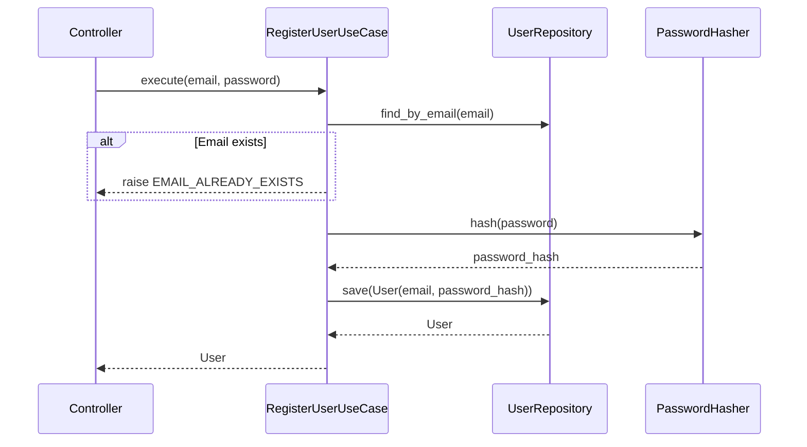
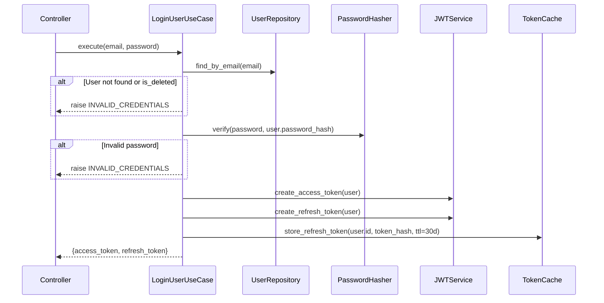
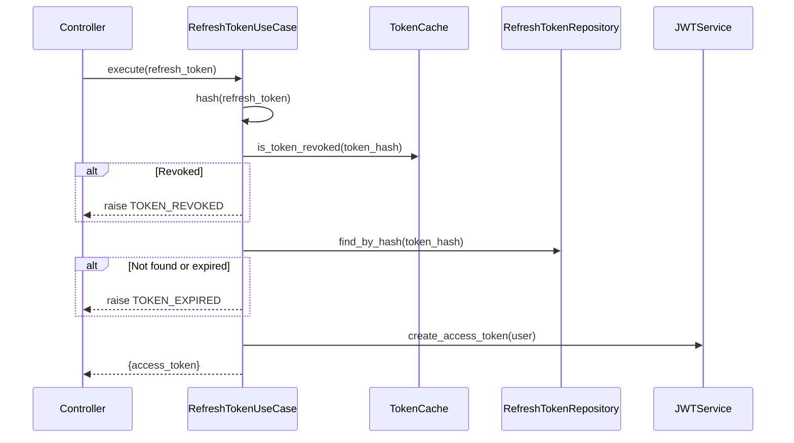
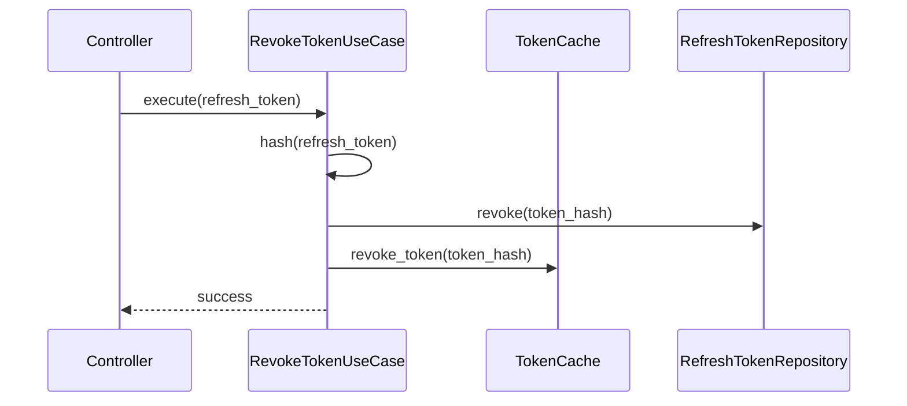
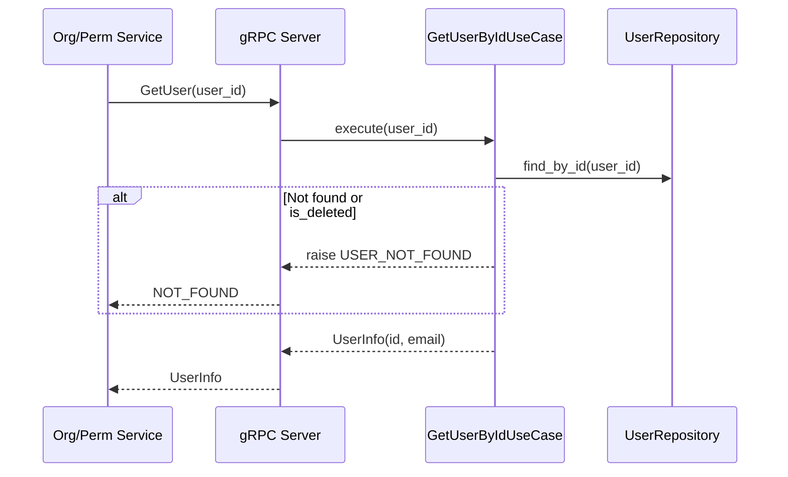
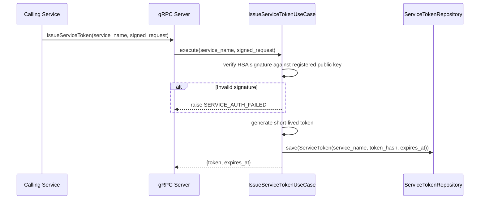
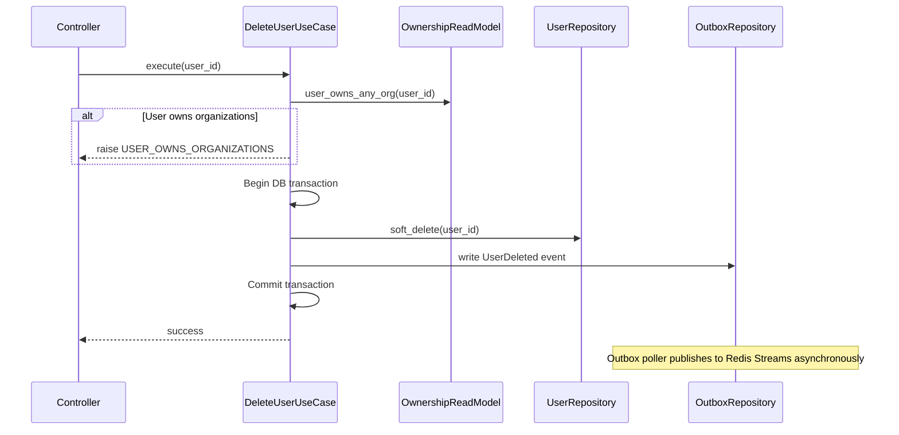

# Auth Service — Detailed Design

> **Cross-references:**
> - System architecture, inter-service communication, and security: [`docs/MSA-DESIGN.md`](../../../docs/MSA-DESIGN.md)
> - Cross-service data flows (login, user deletion): [`docs/MSA-DESIGN.md` Section 5](../../../docs/MSA-DESIGN.md#5-cross-service-data-flows)
> - REST API endpoints and DTOs: [`gateway/docs/GATE_DESIGN.md`](../../../gateway/docs/GATE_DESIGN.md)
> - Org Service (publishes `OrgOwnershipChanged` events consumed by Auth's read-model): [`services/organization/docs/ORGN_DESIGN.md`](../../organization/docs/ORGN_DESIGN.md)
> - Permission Service (subscribes to `UserDeleted` event): [`services/permission/docs/PREM_DESIGN.md`](../../permission/docs/PREM_DESIGN.md)

> **Implementation note:** All `UUID` types shown in port signatures and entity fields below are implemented as `str` (stringified UUIDs) in code. This simplifies serialization across gRPC boundaries and avoids `UUID` ↔ `str` conversions.

## 1. Overview

The Auth Service is responsible for user identity management, authentication, and inter-service trust. It is the most self-contained service and the first candidate for Rust migration in Phase 4.

### Responsibilities

- User registration and login (email/password)
- JWT access/refresh token lifecycle
- Inter-service authentication via short-lived mutual tokens
- User deletion with event-driven cleanup
- Public key distribution for JWT verification

### Non-Responsibilities

- Authorization / permission checks (Permission Service)
- Organization or group management (Organization Service)
- Rate limiting (NGINX / Gateway)

---

## 2. Domain Entities

### User

```python
@dataclass
class User:
    id: str  # UUID v4 string
    email: str
    hashed_password: str | None  # None for OAuth-only users
    is_deleted: bool = False
    created_at: datetime = field(default_factory=lambda: datetime.now(timezone.utc))
    updated_at: datetime = field(default_factory=lambda: datetime.now(timezone.utc))
```

**Invariants:**
- `email` must be unique and valid format
- `password_hash` is `None` only when user has at least one `OAuthAccount`
- Soft-deleted users (`is_deleted=True`) cannot authenticate

### OAuthAccount

> **Status:** Deferred to Phase 1 (OAuth Enhancements). Not yet implemented in domain code.

```python
@dataclass
class OAuthAccount:
    id: UUID
    user_id: UUID
    provider: str  # "google" in MVP
    provider_user_id: str
    access_token_encrypted: bytes
    refresh_token_encrypted: bytes
```

**Invariants:**
- `(provider, provider_user_id)` is unique
- Tokens are encrypted with AES-256-GCM before storage

### RefreshToken

> **Status:** Domain entity deferred. Currently modeled as `RefreshTokenModel` in the infrastructure layer (`infrastructure/persistence/models.py`). Will be promoted to a domain entity when refresh token business logic grows.

```python
@dataclass
class RefreshToken:
    id: UUID
    user_id: UUID
    token_hash: str  # SHA-256 hash of the raw token
    expires_at: datetime
    revoked: bool = False
    created_at: datetime = field(default_factory=datetime.utcnow)
```

**Invariants:**
- Raw token is never stored; only the hash
- Expired or revoked tokens are rejected during refresh

### ServiceToken

> **Status:** Deferred to MVP service-to-service auth. gRPC endpoint exists as `UNIMPLEMENTED` stub.

```python
@dataclass
class ServiceToken:
    id: UUID
    service_name: str
    token_hash: str
    expires_at: datetime
    revoked: bool = False
    created_at: datetime = field(default_factory=datetime.utcnow)
```

**Invariants:**
- Short-lived (minutes, not hours)
- Each service authenticates with its RSA private key to obtain one

---

## 3. JWT Details

### Token Structure

```json
{
  "sub": "user-uuid",
  "email": "user@example.com",
  "iat": 1700000000,
  "exp": 1700003600,
  "type": "access"
}
```

- Access token: 1 hour expiry, signed with RS256
- Refresh token: 30 days expiry, stored hashed in DB, cached in Redis
- Public key exposed at `/.well-known/jwks.json` for other services

---

## 4. Use Case Details

### 4.1 RegisterUser



**Validation:**
- Email format validation (domain layer)
- Password strength: minimum 8 characters, at least one letter and one number

### 4.2 LoginUser



**Notes:**
- Returns generic `INVALID_CREDENTIALS` for both wrong email and wrong password (prevents user enumeration)
- Soft-deleted users are treated as non-existent

### 4.3 RefreshToken



**Notes:**
- Does not rotate refresh tokens in MVP (simplifies implementation)
- Checks Redis cache first, falls back to DB
- If Redis is unavailable, falls back to querying the `refresh_tokens` table `revoked` column directly — revoked tokens are never accepted even during Redis outages

### 4.4 RevokeToken



### 4.5 GetUserById (gRPC)

Internal endpoint consumed by Org and Permission services.



### 4.6 IssueServiceToken



### 4.7 DeleteUser

> **Cross-service flow:** See [`docs/MSA-DESIGN.md` Section 5.4](../../../docs/MSA-DESIGN.md#54-user-deletion-event-driven-cleanup) for the full event-driven cleanup across Auth, Org, and Permission services.



**Notes:**
- User must transfer ownership of all organizations before deletion
- Ownership check uses a local read-model (populated by `OrgOwnershipChanged` events from Org Service) — no gRPC call to Org Service, eliminating the circular dependency
- Uses transactional outbox pattern: the `UserDeleted` event is written to an `outbox` table in the same transaction as the soft-delete. A background poller publishes events from the outbox to Redis Streams. This guarantees the event is never lost even if the service crashes after the commit.

---

## 5. Ports (Interfaces)

### Outbound Ports

```python
class UserRepository(Protocol):
    async def save(self, user: User) -> None: ...
    async def find_by_email(self, email: str) -> User | None: ...
    async def find_by_id(self, user_id: str) -> User | None: ...
    async def delete(self, user_id: str) -> None: ...

class OAuthAccountRepository(Protocol):  # Phase 1
    async def find_by_provider(self, provider: str, provider_id: str) -> OAuthAccount | None: ...
    async def save(self, account: OAuthAccount) -> OAuthAccount: ...

class TokenRepository(Protocol):
    """Combined refresh token storage (Redis)."""
    async def store_refresh_token(self, user_id: str, token_hash: str, expires_at: datetime) -> None: ...
    async def get_refresh_token(self, token_hash: str) -> dict | None: ...
    async def revoke_refresh_token(self, token_hash: str) -> None: ...
    async def is_token_revoked(self, token_hash: str) -> bool: ...

class PasswordHasher(Protocol):
    def hash(self, password: str) -> str: ...
    def verify(self, password: str, hash: str) -> bool: ...

class TokenGenerator(Protocol):
    """JWT token creation and decoding."""
    def generate_access_token(self, user_id: str, email: str) -> str: ...
    def generate_refresh_token(self, user_id: str) -> str: ...
    def decode_token(self, token: str) -> dict: ...

class EventPublisher(Protocol):
    async def publish_user_deleted(self, user_id: str) -> None: ...

# --- Deferred ports (not yet implemented) ---

class OwnershipReadModel(Protocol):  # Deferred: requires OrgOwnershipChanged subscriber
    """Local read-model maintained via OrgOwnershipChanged events from Org Service.
    Eliminates Auth→Org gRPC dependency."""
    async def user_owns_any_org(self, user_id: str) -> bool: ...
    async def add_ownership(self, user_id: str, org_id: str) -> None: ...
    async def remove_ownership(self, user_id: str, org_id: str) -> None: ...
    async def transfer_ownership(self, org_id: str, old_owner_id: str, new_owner_id: str) -> None: ...

class OutboxRepository(Protocol):  # Deferred: DeleteUser publishes directly for now
    async def write(self, event_type: str, payload: dict) -> None: ...

class EventSubscriber(Protocol):  # Deferred: requires OwnershipReadModel
    async def on_org_ownership_changed(self, org_id: str, old_owner_id: str | None, new_owner_id: str | None) -> None: ...

class ServiceTokenRepository(Protocol):  # Deferred: service-to-service auth
    async def save(self, token: ServiceToken) -> ServiceToken: ...
```

### Inbound Ports

```python
class RegisterUseCase(Protocol):
    async def execute(self, email: str, password: str) -> str: ...  # Returns user_id

class LoginUseCase(Protocol):
    async def execute(self, email: str, password: str) -> dict: ...  # Returns token pair dict

class RefreshTokenUseCase(Protocol):
    async def execute(self, refresh_token: str) -> dict: ...  # Returns new access token dict

class RevokeTokenUseCase(Protocol):
    async def execute(self, refresh_token: str) -> None: ...

class GetUserUseCase(Protocol):
    async def execute(self, user_id: str) -> User: ...

class DeleteUserUseCase(Protocol):
    async def execute(self, user_id: str) -> None: ...

class IssueServiceTokenUseCase(Protocol):  # Deferred: returns UNIMPLEMENTED
    async def execute(self, service_name: str, signed_request: bytes) -> ServiceTokenResult: ...
```

---

## 6. Database Schema

```sql
CREATE TABLE users (
    id UUID PRIMARY KEY DEFAULT gen_random_uuid(),
    email VARCHAR(255) UNIQUE NOT NULL,
    hashed_password VARCHAR(255),
    is_deleted BOOLEAN DEFAULT false,
    created_at TIMESTAMPTZ DEFAULT now(),
    updated_at TIMESTAMPTZ DEFAULT now()
);

CREATE TABLE oauth_accounts (
    id UUID PRIMARY KEY DEFAULT gen_random_uuid(),
    user_id UUID REFERENCES users(id) ON DELETE CASCADE,
    provider VARCHAR(50) NOT NULL,
    provider_user_id VARCHAR(255) NOT NULL,
    access_token_encrypted BYTEA,
    refresh_token_encrypted BYTEA,
    UNIQUE(provider, provider_user_id)
);

CREATE TABLE refresh_tokens (
    id UUID PRIMARY KEY DEFAULT gen_random_uuid(),
    user_id UUID REFERENCES users(id) ON DELETE CASCADE,
    token_hash VARCHAR(255) UNIQUE NOT NULL,
    expires_at TIMESTAMPTZ NOT NULL,
    revoked BOOLEAN DEFAULT false,
    created_at TIMESTAMPTZ DEFAULT now()
);

CREATE TABLE service_tokens (
    id UUID PRIMARY KEY DEFAULT gen_random_uuid(),
    service_name VARCHAR(100) NOT NULL,
    token_hash VARCHAR(255) UNIQUE NOT NULL,
    expires_at TIMESTAMPTZ NOT NULL,
    revoked BOOLEAN DEFAULT false,
    created_at TIMESTAMPTZ DEFAULT now()
);
CREATE INDEX idx_service_tokens_revoke ON service_tokens(service_name, revoked);

-- Local read-model: tracks which users own which orgs.
-- Populated by OrgOwnershipChanged events from Org Service.
-- Queried by DeleteUser to avoid circular gRPC dependency.
CREATE TABLE ownership_read_model (
    user_id UUID NOT NULL,
    org_id UUID NOT NULL,
    PRIMARY KEY (user_id, org_id)
);
CREATE INDEX idx_ownership_user ON ownership_read_model(user_id);

-- Transactional outbox: events written in same DB transaction as domain changes.
-- A background poller reads and publishes to Redis Streams, then marks as published.
CREATE TABLE outbox (
    id UUID PRIMARY KEY DEFAULT gen_random_uuid(),
    event_type VARCHAR(100) NOT NULL,
    payload JSONB NOT NULL,
    created_at TIMESTAMPTZ DEFAULT now(),
    published BOOLEAN DEFAULT false
);
CREATE INDEX idx_outbox_unpublished ON outbox(published, created_at) WHERE NOT published;
```

---

## 7. Error Handling

### Domain Errors

```python
class AuthError(Enum):
    USER_NOT_FOUND = "user_not_found"
    INVALID_CREDENTIALS = "invalid_credentials"
    INVALID_TOKEN = "invalid_token"
    TOKEN_EXPIRED = "token_expired"
    TOKEN_REVOKED = "token_revoked"
    EMAIL_ALREADY_EXISTS = "email_already_exists"
    OAUTH_PROVIDER_ERROR = "oauth_provider_error"
    SERVICE_AUTH_FAILED = "service_auth_failed"
    USER_OWNS_ORGANIZATIONS = "user_owns_organizations"
```

### Error Translation

| Domain Error | gRPC Status | HTTP Status |
|---|---|---|
| `USER_NOT_FOUND` | `NOT_FOUND` | 404 |
| `INVALID_CREDENTIALS` | `UNAUTHENTICATED` | 401 |
| `INVALID_TOKEN` | `UNAUTHENTICATED` | 401 |
| `TOKEN_EXPIRED` | `UNAUTHENTICATED` | 401 |
| `TOKEN_REVOKED` | `UNAUTHENTICATED` | 401 |
| `EMAIL_ALREADY_EXISTS` | `ALREADY_EXISTS` | 409 |
| `SERVICE_AUTH_FAILED` | `UNAUTHENTICATED` | 401 |
| `USER_OWNS_ORGANIZATIONS` | `FAILED_PRECONDITION` | 409 |

---

## 8. gRPC Service Definition

```protobuf
syntax = "proto3";
package auth.v1;

service AuthService {
  rpc Login(LoginRequest) returns (LoginResponse);
  rpc Register(RegisterRequest) returns (RegisterResponse);
  rpc RefreshToken(RefreshTokenRequest) returns (RefreshTokenResponse);
  rpc RevokeToken(RevokeTokenRequest) returns (RevokeTokenResponse);
  rpc GetUser(GetUserRequest) returns (GetUserResponse);
  rpc IssueServiceToken(IssueServiceTokenRequest) returns (IssueServiceTokenResponse);
  rpc DeleteUser(DeleteUserRequest) returns (DeleteUserResponse);
}

message LoginRequest {
  string email = 1;
  string password = 2;
}

message LoginResponse {
  string access_token = 1;
  string refresh_token = 2;
}

message RegisterRequest {
  string email = 1;
  string password = 2;
}

message RegisterResponse {
  string user_id = 1;
  string email = 2;
}

message RefreshTokenRequest {
  string refresh_token = 1;
}

message RefreshTokenResponse {
  string access_token = 1;
}

message RevokeTokenRequest {
  string refresh_token = 1;
}

message RevokeTokenResponse {}

message GetUserRequest {
  string user_id = 1;
}

message GetUserResponse {
  string user_id = 1;
  string email = 2;
  bool is_deleted = 3;
}

message IssueServiceTokenRequest {
  string service_name = 1;
  bytes signed_request = 2;
}

message IssueServiceTokenResponse {
  string token = 1;
  int64 expires_at = 2;
}

message DeleteUserRequest {
  string user_id = 1;
}

message DeleteUserResponse {}
```
