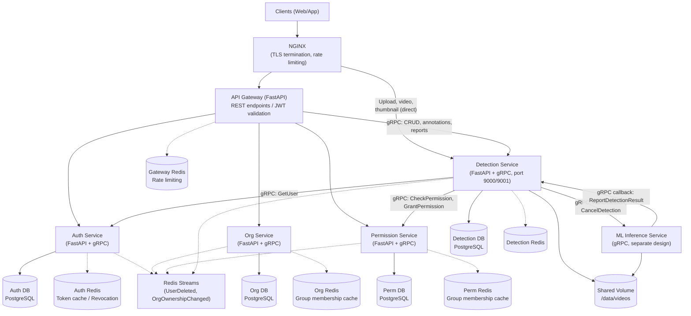
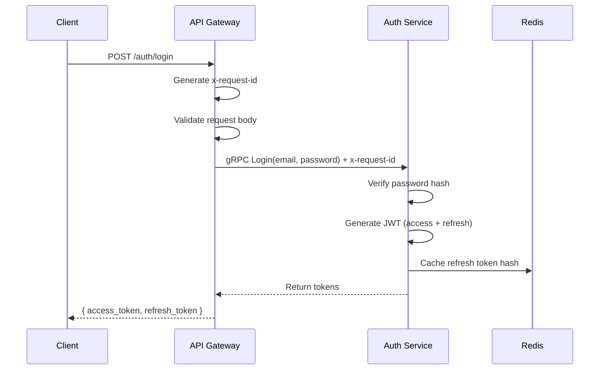
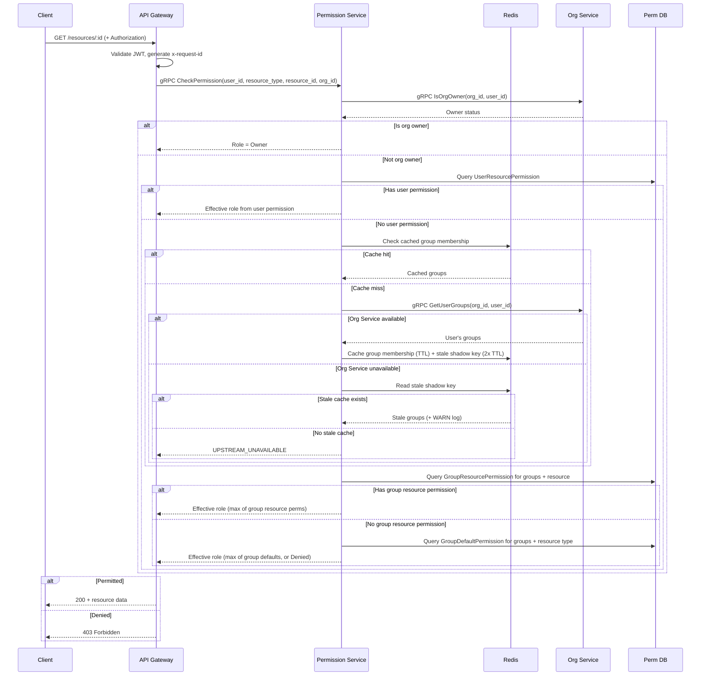
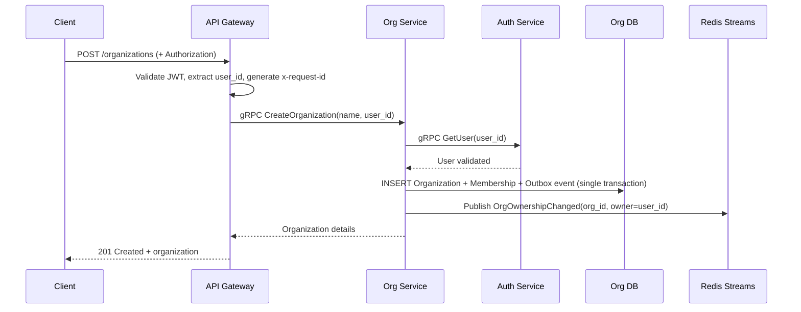
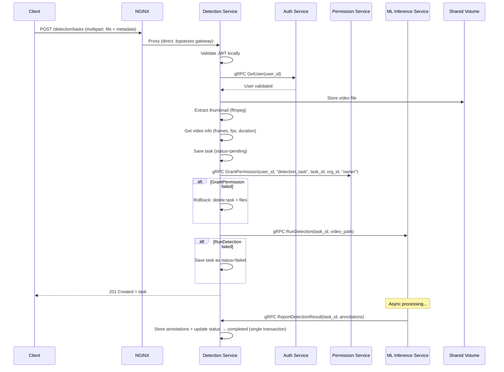
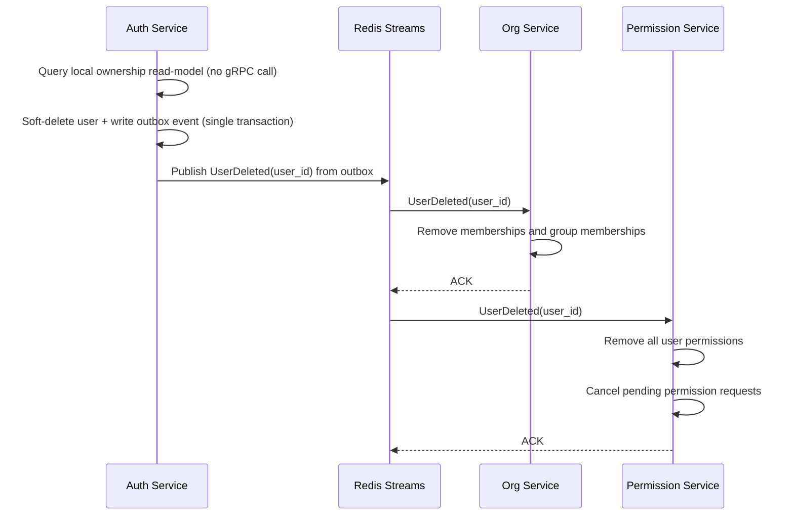

# MSA Design — Auth, Organization, Permission & Detection System

## 1. Overview

A microservice-based system providing authentication, organization management, permission management, and cat motion detection as independent services. Built with Python (FastAPI) for MVP, with a planned migration to Rust post-MVP.

### Principles

- MSA-based auth, organization, permission management, and detection system.
- Clean Architecture per service (Domain, Application, Infrastructure, Presentation).
- Python (FastAPI) for MVP, migration to Rust post-MVP.
- Monorepo for MVP with polyrepo-ready directory boundaries. Split into separate repos when deploy cadence, team size, or CI demands it.

### Key Decisions

| Decision | Choice | Rationale |
|---|---|---|
| Language (MVP) | Python / FastAPI | Rapid development velocity |
| Language (Post-MVP) | Rust | Performance, type safety |
| Database | PostgreSQL + Redis | Postgres for persistence, Redis for session/token caching |
| Inter-service comm | gRPC | Strong contracts via protobuf, efficient binary protocol |
| External API (MVP) | REST gateway | REST for simplicity. GraphQL deferred to later phase |
| Repo strategy | Monorepo (MVP), polyrepo later | Single repo with polyrepo-ready directory boundaries. Split when deploy cadence, team size, or CI demands it |
| Service auth | Short-lived mutual tokens + JWT | Services request short-lived tokens from Auth service; JWT for user context |
| Org hierarchy | Unlimited depth (ltree) | Flexible, covers any enterprise structure |
| Permission model | Hybrid: group defaults + resource overrides | Balance between simplicity and granularity |
| Proto versioning | Semantic versioning with v2 directories | Breaking changes go into new version dirs (e.g., `auth/v2/`) |
| User deletion | Event-driven cleanup | Auth publishes `UserDeleted` event; Org, Perm, and Detection subscribe and clean up |
| Video storage (MVP) | Local filesystem (shared volume) | Detection and ML services share a Docker volume; S3 migration planned post-MVP |
| ML inference | Async gRPC callback | Detection dispatches jobs to ML service; ML calls back with results |
| Testing strategy | Contract tests + Docker Compose | Mock gRPC for CI speed; full-stack Docker Compose for pre-release |

---

## 2. System Architecture



Each service has its own dedicated Redis instance for isolation. Each service runs a single process with both FastAPI (HTTP) and gRPC on separate ports, sharing an asyncio event loop and DI container.

### Inter-Service Communication

Services communicate via gRPC with protobuf contracts stored in a shared `proto-registry` repo. Proto files use semantic versioning — breaking changes go into new version directories (e.g., `auth/v2/auth.proto`). Non-breaking changes are additive only within a version.

- **Service identity**: Each service has an RSA key pair. The public key is registered with the Auth service. At startup (and periodically), each service signs a request with its private key to obtain a short-lived token from Auth. No shared secrets — authentication is asymmetric.
- **User context**: The user's JWT is forwarded in gRPC metadata. Receiving services validate it using the Auth service's public key.
- **Correlation ID**: The API Gateway generates a UUID `x-request-id` for every incoming request and passes it in gRPC metadata. All services include this ID in every log line for cross-service request tracing.
- **gRPC deadline policy**: 5 seconds for Gateway→Service calls, 3 seconds for Service→Service calls. No retries for MVP — fail fast.
- **Call patterns** (dependency direction is strictly acyclic — no circular gRPC calls):
  - Gateway -> Auth: login, token refresh
  - Gateway -> Org: CRUD org/groups, membership management
  - Gateway -> Perm: check permissions, assign roles
  - Gateway -> Detection: task CRUD, annotations, reports (proxied REST → gRPC; upload/streaming bypass gateway, direct through NGINX)
  - Org -> Auth: validate user exists
  - Perm -> Auth: validate user exists
  - Perm -> Org: resolve group membership for permission inheritance
  - Detection -> Auth: validate user exists (on task creation)
  - Detection -> Perm: check/grant/revoke per-task permissions (`resource_type = "detection_task"`)
  - Detection -> ML Inference: dispatch/cancel detection jobs (gRPC `RunDetection`, `CancelDetection`)
  - ML Inference -> Detection: report detection results (gRPC callback `ReportDetectionResult`)
- **Event patterns** (Redis Streams, at-least-once delivery via consumer groups with ACK):
  - Auth -> Broker: `UserDeleted` event
  - Org -> Broker: `OrgOwnershipChanged` event (on create, transfer, delete)
  - Auth <- Broker: subscribes to `OrgOwnershipChanged`, maintains local ownership read-model
  - Org <- Broker: subscribes to `UserDeleted`, cleans up memberships and group memberships
  - Perm <- Broker: subscribes to `UserDeleted`, cleans up permissions
  - Detection <- Broker: subscribes to `UserDeleted`, cleans up tasks and files (future)
- **Event contract**: All events use JSON with the following envelope:
  ```json
  {
    "event_id": "uuid",
    "event_type": "UserDeleted | OrgOwnershipChanged",
    "payload": { ... },
    "timestamp": "ISO-8601"
  }
  ```
  Handlers must be idempotent (e.g., `DELETE WHERE user_id = X` is naturally idempotent). Events are published via a transactional outbox table — the event is written to an `outbox` table in the same DB transaction as the domain change, then published asynchronously. This prevents event loss if the service crashes after the domain change but before publishing.

---

## 3. Repository Structure

### Strategy: Monorepo Now, Polyrepo Later

All services live in a single monorepo during MVP with clear directory boundaries. Each service directory is self-contained (own `Dockerfile`, `pyproject.toml`, `alembic/`, `tests/`) so it can be extracted into its own repo cleanly via `git subtree split`.

**When to split into independent repos** — when any of these triggers occur:

1. **Independent deploy cadence** — one service needs to ship multiple times per day while another ships weekly. Shared CI rebuilds everything on every push.
2. **Multiple teams** — different people/teams own different services and need independent code review, branching, and release cycles.
3. **Access control** — need to restrict who can see or modify a specific service's code (e.g., Auth has stricter access).
4. **CI/CD bottleneck** — monorepo build takes too long and caching/selective-build strategies are exhausted.

Expected split timeline: **Phase 3 or later**, when CI/CD pipelines and Kubernetes are being added.

### Monorepo Layout

```
service-boilerplate/
├── proto/                    # Shared proto definitions (future proto-registry repo)
│   ├── auth/
│   │   └── v1/
│   │       └── auth.proto
│   ├── organization/
│   │   └── v1/
│   │       └── organization.proto
│   ├── permission/
│   │   └── v1/
│   │       └── permission.proto
│   └── detection/
│       └── v1/
│           └── detection.proto
├── gen/                      # Generated gRPC stubs (gitignored)
│   └── python/
├── lib/                      # Shared libraries
│   └── events/               # Redis Streams event bus library
├── services/
│   ├── auth/                 # Future auth-service repo
│   ├── organization/         # Future org-service repo
│   ├── permission/           # Future perm-service repo
│   └── detection/            # Future detection-service repo
├── gateway/                  # Future api-gateway repo
├── buf.yaml                  # buf lint/breaking config
├── buf.gen.yaml              # buf code generation config
├── docker-compose.yml
├── nginx/
└── docs/
```

### Per-Service Directory (Clean Architecture)

```
services/<service>/
├── proto/                    # Generated gRPC stubs (gitignored, built in Dockerfile)
├── src/
│   ├── domain/               # Entities, value objects, domain errors
│   │   ├── entities.py
│   │   └── errors.py
│   ├── application/          # Use cases, ports (interfaces)
│   │   ├── ports/
│   │   │   ├── inbound.py    # Use case interfaces
│   │   │   └── outbound.py   # Repository / external service interfaces
│   │   └── services/         # Use case implementations
│   ├── infrastructure/       # Adapters (DB, gRPC clients, Redis)
│   │   ├── persistence/      # SQLAlchemy models, repository implementations
│   │   ├── grpc/             # gRPC server + client adapters
│   │   ├── cache/            # Redis adapter
│   │   └── config.py
│   └── presentation/         # FastAPI routes, DTOs, error handlers
│       ├── routes/
│       ├── dto/
│       └── middleware/
├── tests/
│   ├── unit/                 # Unit tests with mock gRPC servers (contract tests)
│   └── integration/          # Docker Compose full-stack tests
├── alembic/                  # DB migrations
├── Dockerfile
├── pyproject.toml
└── README.md
```

### API Gateway Directory

```
gateway/
├── src/
│   ├── rest/                 # REST route definitions
│   │   ├── auth_routes.py
│   │   ├── org_routes.py
│   │   ├── perm_routes.py
│   │   └── detection_routes.py
│   ├── grpc_clients/         # gRPC client wrappers for each service
│   ├── middleware/
│   │   ├── auth.py           # JWT validation middleware
│   │   ├── correlation.py    # x-request-id generation and propagation
│   │   └── rate_limit.py
│   └── main.py
├── Dockerfile
└── pyproject.toml
```

---

## 4. Service Designs

Each service has its own detailed design document covering domain entities, use cases (with sequence diagrams), ports/interfaces, database schema, error handling, and gRPC proto definitions.

| Service | Design Document |
|---|---|
| Auth Service | [`services/auth/docs/AUTH_DESIGN.md`](../services/auth/docs/AUTH_DESIGN.md) |
| Organization Service | [`services/organization/docs/ORGN_DESIGN.md`](../services/organization/docs/ORGN_DESIGN.md) |
| Permission Service | [`services/permission/docs/PREM_DESIGN.md`](../services/permission/docs/PREM_DESIGN.md) |
| Detection Service | [`services/detection/docs/DETECTION_DESIGN.md`](../services/detection/docs/DETECTION_DESIGN.md) |
| API Gateway | [`gateway/docs/GATE_DESIGN.md`](../gateway/docs/GATE_DESIGN.md) |

---

## 5. Cross-Service Data Flows

The following diagrams show how services interact for key operations. For internal use case details within each service, see the respective service design documents linked in [Section 4](#4-service-designs).

### 5.1 User Login (Email/Password)



### 5.2 Check Permission on a Resource



### 5.3 Create Organization



### 5.4 Create Detection Task (Video Upload)



**Notes:**
- **Upload is a direct endpoint** — frontend uploads directly to Detection Service through NGINX (not through gateway) because gRPC is impractical for 500MB file uploads. JWT validated locally.
- Video/thumbnail streaming endpoints are also direct (through NGINX, bypassing gateway). All direct endpoints validate JWT locally and check permissions via gRPC to Permission Service.
- CRUD/workflow endpoints (list, get, delete, retry, annotations, submit, report) go through the API Gateway via gRPC.
- ML inference is asynchronous — the create endpoint returns immediately with `status=pending`.

### 5.5 User Deletion (Event-Driven Cleanup)



---

## 6. Security Considerations

- **Password hashing**: bcrypt with cost factor 12
- **JWT signing**: RS256 (asymmetric). Private key in Auth service only, public key shared.
- **Service-to-service auth**: Asymmetric bootstrap — each service has an RSA key pair, public key registered with Auth service. Services sign requests with their private key to obtain short-lived tokens. No shared secrets or static API keys.
- **OAuth token storage**: OAuth access/refresh tokens encrypted at rest using AES-256-GCM. Encryption key stored in environment variable or secrets manager.
- **Rate limiting**: Redis-based, applied at NGINX and gateway levels
- **Input validation**: Pydantic models at presentation layer, domain validation in entities
- **CORS**: Configured at NGINX level
- **No PII in logs**: Structured logging with tracing, user IDs only (never emails/tokens in logs)
- **Correlation IDs**: Every request gets a UUID `x-request-id` at the gateway, propagated through all gRPC calls and included in all log lines
- **Direct endpoint auth**: Detection Service upload, video streaming, and thumbnail endpoints validate JWTs locally using the Auth service's cached public key (refreshed periodically) and check permissions via gRPC to the Permission Service. These endpoints bypass the gateway but are routed through NGINX for TLS and rate limiting.
- **Video upload validation**: Accepted formats (mp4, avi, mov), max 500MB, validated at the Detection Service presentation layer

---

## 7. Technology Stack (MVP)

| Component | Technology |
|---|---|
| Language | Python 3.12+ |
| Web Framework | FastAPI |
| gRPC | grpcio + grpcio-tools |
| ORM | SQLAlchemy 2.0 (async) |
| Migrations | Alembic |
| Database | PostgreSQL 16 |
| Cache | Redis 7 |
| Message Broker | Redis Streams (Redis 7) |
| Auth | PyJWT + cryptography (RS256) |
| Token Encryption | cryptography (AES-256-GCM) |
| Password Hashing | bcrypt (direct, cost factor 12) |
| Validation | Pydantic v2 |
| Testing | pytest + pytest-asyncio (unit/contract) + Docker Compose (integration) |
| Containerization | Docker + Docker Compose |
| Reverse Proxy | NGINX |
| Media Processing | ffmpeg (thumbnail extraction, video info) |
| Proto Management | buf |

---

## 8. MVP Scope

### In MVP

- Email/password registration and login (no email verification)
- JWT access/refresh token flow
- ~~Short-lived mutual tokens for inter-service auth~~ (deferred — requires coordinated rollout across all services)
- Organization CRUD (create, list, delete)
- Add/remove members to organization
- Transfer organization ownership
- Group CRUD with unlimited hierarchy (ltree)
- Add/remove members to groups
- Permission check (hybrid resolution: org owner > resource > group default)
- Grant/revoke permissions on resources (split user/group permission tables)
- Set group default permissions
- REST gateway with correlation ID propagation
- Event-driven user deletion cleanup
- Redis-cached group membership for permission resolution
- Detection task CRUD and lifecycle management (pending → processing → completed/failed → submitted)
- Video upload, storage, and streaming (local filesystem via shared Docker volume)
- Experiment metadata storage (experiment info, subject info, environment, intervention)
- ML inference orchestration via gRPC (async dispatch + callback)
- Annotation storage and HITL (Human-in-the-Loop) review workflow (segment-only edits; frame annotations immutable)
- Detection report generation
- Thumbnail generation on upload (ffmpeg)
- Per-task permission integration via Permission Service (`resource_type = "detection_task"`)
- Direct endpoints (upload, video streaming, thumbnails) with local JWT validation + permission check, routed through NGINX
- Processing timeout sweep (stuck `processing` tasks auto-transition to `failed`)
- Contract tests (mock gRPC) + Docker Compose integration tests
- Docker Compose for local development

### Phase 1 — Auth Enhancements

- Google OAuth2 login
- Additional OAuth providers (GitHub, Apple)
- Email verification flow
- Password reset flow

### Phase 2 — Collaboration & Governance

- Organization invitations (invite by email)
- Permission request/approval workflow
- Audit logging (who changed what permission, when)
- Bulk permission operations

### Phase 3 — Observability, Operations & GraphQL

- Permission caching in Redis
- Service mesh / observability (OpenTelemetry)
- CI/CD pipelines
- Kubernetes deployment manifests
- GraphQL gateway layer (Strawberry) alongside REST

### Phase 4 — Rust Migration

- Strangler fig pattern: run Rust and Python versions side-by-side per service, gradually shift traffic
- Migration order: Auth (most self-contained) -> Perm -> Org -> Detection -> Gateway
- gRPC proto contracts ensure cross-language compatibility during migration
