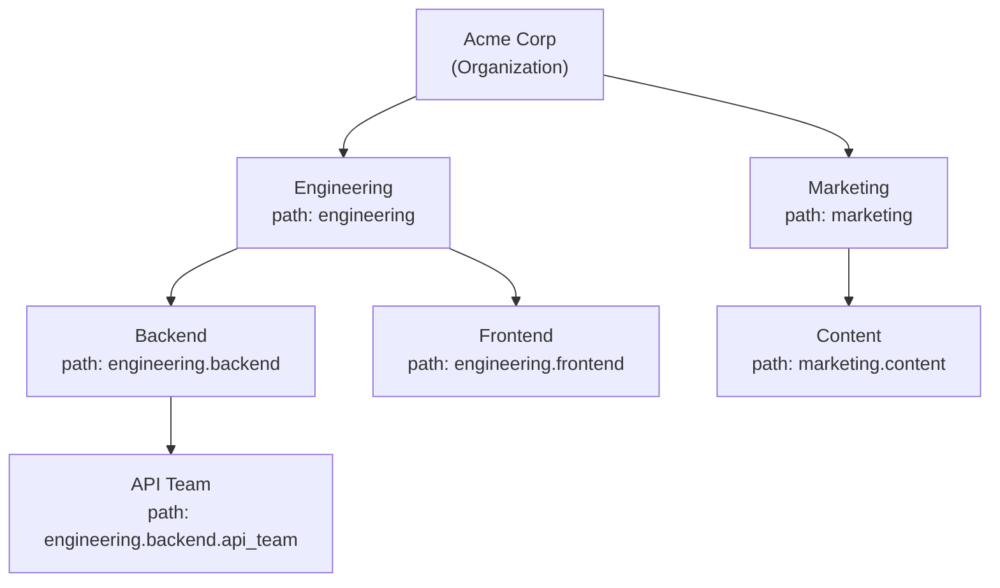
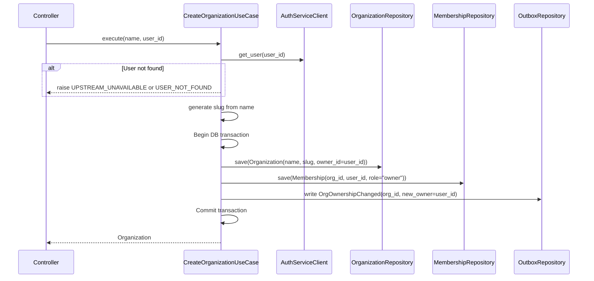
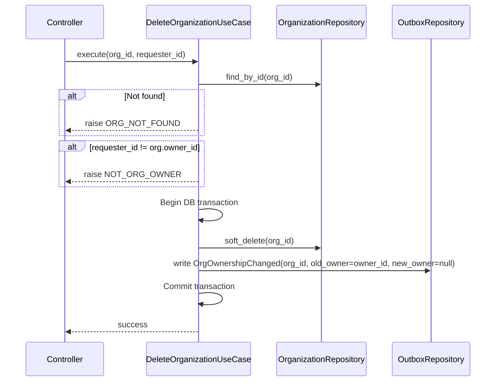
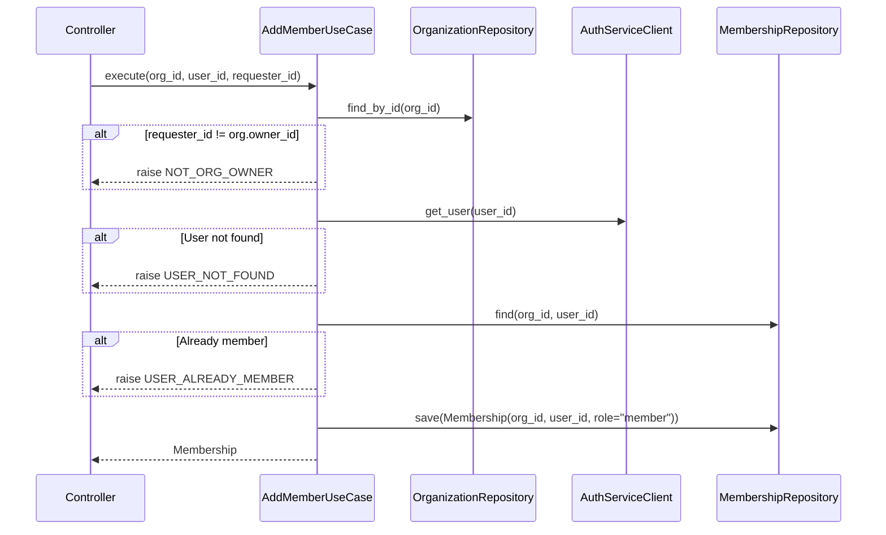
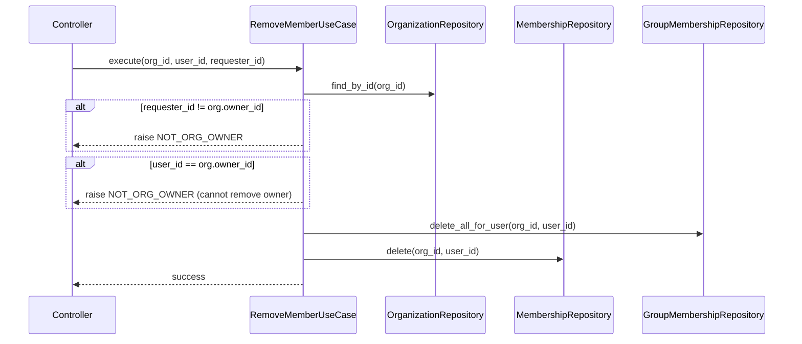
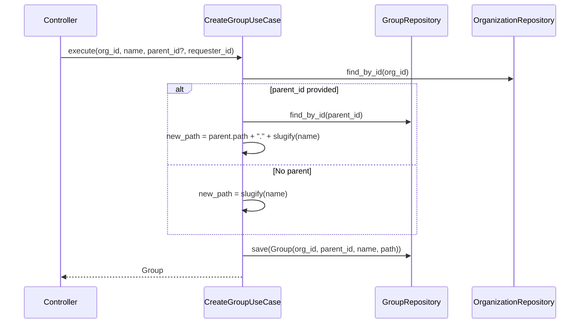
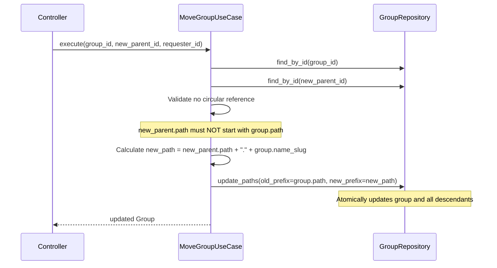
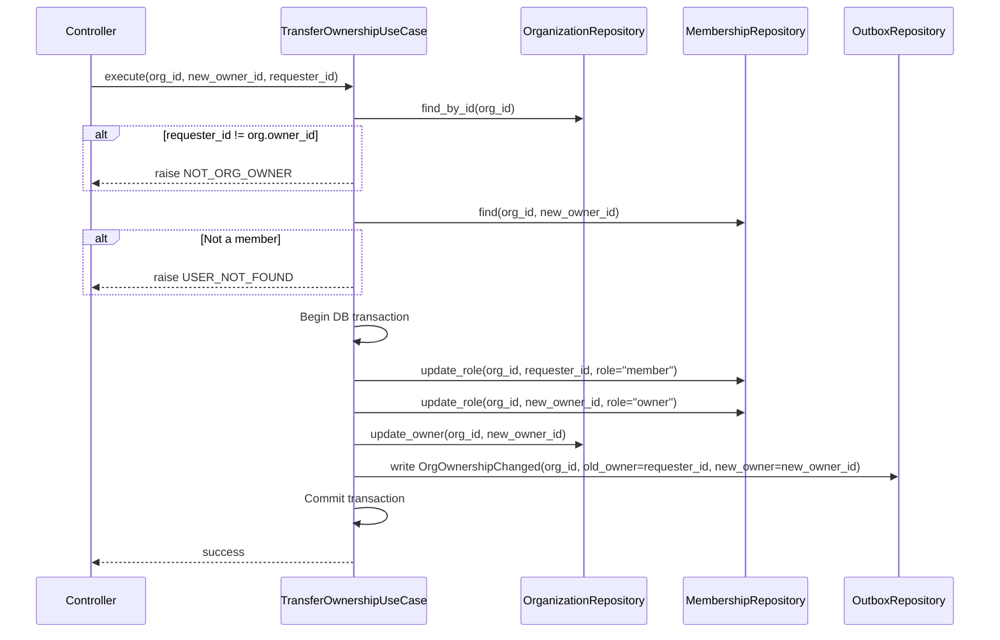
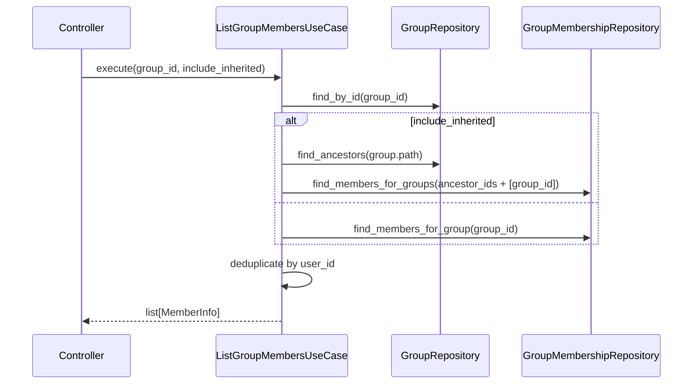
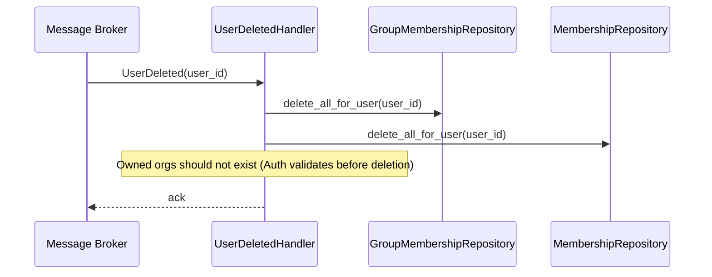

# Organization Service — Detailed Design

> **Cross-references:**
> - System architecture, inter-service communication, and security: [`docs/MSA-DESIGN.md`](../../../docs/MSA-DESIGN.md)
> - Cross-service data flows (create org, user deletion): [`docs/MSA-DESIGN.md` Section 5](../../../docs/MSA-DESIGN.md#5-cross-service-data-flows)
> - REST API endpoints and DTOs: [`gateway/docs/GATE_DESIGN.md`](../../../gateway/docs/GATE_DESIGN.md)
> - Auth Service (user validation via gRPC, `UserDeleted` event source): [`services/auth/docs/AUTH_DESIGN.md`](../../auth/docs/AUTH_DESIGN.md)
> - Permission Service (consumes group membership data via gRPC, subscribes to `UserDeleted`): [`services/permission/docs/PREM_DESIGN.md`](../../permission/docs/PREM_DESIGN.md)

> **Implementation note:** All `UUID` types shown in port signatures and entity fields below are implemented as `str` (stringified UUIDs) in code. Error types are implemented as individual exception classes (e.g., `OrgNotFound(DomainError)`) rather than an enum, following the same pattern as the Auth Service. All `save()` methods return `None` instead of the entity.

## 1. Overview

The Organization Service manages organizations, hierarchical groups (via PostgreSQL ltree), and memberships. It depends on Auth Service for user validation. It publishes `OrgOwnershipChanged` events (consumed by Auth Service for its ownership read-model) and subscribes to `UserDeleted` events.

### Responsibilities

- Organization CRUD and ownership management
- Group hierarchy with unlimited depth (ltree)
- Organization membership (owner/member roles)
- Group membership management
- Cleanup on user deletion events

### Non-Responsibilities

- User authentication (Auth Service)
- Permission/role management on resources (Permission Service)

---

## 2. Domain Entities

### Organization

```python
@dataclass
class Organization:
    id: UUID
    name: str
    slug: str  # URL-safe identifier, unique
    owner_id: UUID  # References auth.users
    is_deleted: bool = False
    created_at: datetime = field(default_factory=datetime.utcnow)
```

**Invariants:**
- `slug` is unique, auto-generated from `name` (lowercase, hyphenated)
- `owner_id` must be a valid, non-deleted user (validated via Auth gRPC)
- Only the owner can delete the organization

### Group

```python
@dataclass
class Group:
    id: UUID
    org_id: UUID
    parent_id: UUID | None  # None for root groups
    name: str
    path: str  # ltree path (e.g., "engineering.backend.api_team")
    created_at: datetime = field(default_factory=datetime.utcnow)
```

**Invariants:**
- `path` is unique within an organization
- `path` is derived from parent path + slugified group name
- Moving a group updates all descendant paths atomically
- Circular hierarchy is impossible (validated on move)

### Membership

```python
@dataclass
class Membership:
    id: UUID
    org_id: UUID
    user_id: UUID
    role: str  # "owner" | "member"
    joined_at: datetime = field(default_factory=datetime.utcnow)
```

**Invariants:**
- `(org_id, user_id)` is unique
- Exactly one `owner` per organization at any time
- Owner cannot be removed; must transfer ownership first

### GroupMembership

```python
@dataclass
class GroupMembership:
    id: UUID
    group_id: UUID
    user_id: UUID
    added_at: datetime = field(default_factory=datetime.utcnow)
```

**Invariants:**
- `(group_id, user_id)` is unique
- User must be an org member before being added to a group

---

## 3. Hierarchy Model (ltree)

Groups use PostgreSQL's `ltree` extension for unlimited-depth hierarchical queries.



Key queries enabled by ltree:
- **All descendants**: `WHERE path <@ 'engineering'`
- **All ancestors**: `WHERE 'engineering.backend.api_team' <@ path`
- **Direct children**: `WHERE parent_id = :group_id`
- **Depth check**: `WHERE nlevel(path) = 2`

---

## 4. Use Case Details

### 4.1 CreateOrganization

> **Cross-service flow:** See [`docs/MSA-DESIGN.md` Section 5.3](../../../docs/MSA-DESIGN.md#53-create-organization) for the full Gateway → Org → Auth flow.



### 4.2 DeleteOrganization



### 4.3 AddMember



### 4.4 RemoveMember



### 4.5 CreateGroup



### 4.6 MoveGroup



**Cycle detection:** If `new_parent.path` starts with `group.path`, the move would create a cycle. Reject with `CIRCULAR_HIERARCHY`.

### 4.7 TransferOwnership



**Notes:**
- All 3 updates (old owner role, new owner role, org.owner_id) plus the outbox event must be in a single DB transaction to guarantee atomicity.

### 4.8 ListGroupMembers

Returns all members of a group, including members inherited from ancestor groups.



### 4.9 HandleUserDeleted (Event Handler)

> **Cross-service flow:** See [`docs/MSA-DESIGN.md` Section 5.4](../../../docs/MSA-DESIGN.md#54-user-deletion-event-driven-cleanup) for the full event-driven cleanup across Auth, Org, and Permission services.



---

## 5. Ports (Interfaces)

### Outbound Ports

```python
class OrganizationRepository(Protocol):
    async def save(self, org: Organization) -> Organization: ...
    async def find_by_id(self, org_id: UUID) -> Organization | None: ...
    async def find_by_user(self, user_id: UUID) -> list[Organization]: ...
    async def soft_delete(self, org_id: UUID) -> None: ...
    async def update_owner(self, org_id: UUID, new_owner_id: UUID) -> None: ...

class GroupRepository(Protocol):
    async def save(self, group: Group) -> Group: ...
    async def find_by_id(self, group_id: UUID) -> Group | None: ...
    async def find_by_org(self, org_id: UUID) -> list[Group]: ...
    async def find_descendants(self, path: str) -> list[Group]: ...
    async def find_ancestors(self, path: str) -> list[Group]: ...
    async def update_paths(self, old_prefix: str, new_prefix: str) -> int: ...
    async def delete(self, group_id: UUID) -> None: ...

class MembershipRepository(Protocol):
    async def save(self, membership: Membership) -> Membership: ...
    async def find(self, org_id: UUID, user_id: UUID) -> Membership | None: ...
    async def find_by_org(self, org_id: UUID) -> list[Membership]: ...
    async def find_by_user(self, user_id: UUID) -> list[Membership]: ...
    async def update_role(self, org_id: UUID, user_id: UUID, role: str) -> None: ...
    async def delete(self, org_id: UUID, user_id: UUID) -> None: ...
    async def delete_all_for_user(self, user_id: UUID) -> int: ...

class GroupMembershipRepository(Protocol):
    async def save(self, gm: GroupMembership) -> GroupMembership: ...
    async def find_members_for_group(self, group_id: UUID) -> list[GroupMembership]: ...
    async def find_members_for_groups(self, group_ids: list[UUID]) -> list[GroupMembership]: ...
    async def find_groups_for_user(self, org_id: UUID, user_id: UUID) -> list[GroupMembership]: ...
    async def delete(self, group_id: UUID, user_id: UUID) -> None: ...
    async def delete_all_for_user(self, user_id: UUID) -> int: ...
    async def delete_all_for_user_in_org(self, org_id: UUID, user_id: UUID) -> int: ...

class AuthServiceClient(Protocol):
    """Calls Auth Service gRPC. See auth gRPC definition in services/auth/docs/AUTH_DESIGN.md."""
    async def get_user(self, user_id: UUID) -> UserInfo | None: ...

class GroupMembershipCache(Protocol):
    async def get_user_groups(self, org_id: UUID, user_id: UUID) -> list[GroupInfo] | None: ...
    async def set_user_groups(self, org_id: UUID, user_id: UUID, groups: list[GroupInfo], ttl: int) -> None: ...
    async def invalidate_user_groups(self, org_id: UUID, user_id: UUID) -> None: ...

class EventPublisher(Protocol):
    async def publish_org_ownership_changed(self, org_id: UUID, old_owner_id: UUID | None, new_owner_id: UUID | None) -> None: ...

class OutboxRepository(Protocol):
    async def write(self, event_type: str, payload: dict) -> None: ...

class EventSubscriber(Protocol):
    async def on_user_deleted(self, user_id: UUID) -> None: ...
```

### Inbound Ports

```python
class CreateOrganizationUseCase(Protocol):
    async def execute(self, name: str, user_id: UUID) -> Organization: ...

class DeleteOrganizationUseCase(Protocol):
    async def execute(self, org_id: UUID, requester_id: UUID) -> None: ...

class AddMemberUseCase(Protocol):
    async def execute(self, org_id: UUID, user_id: UUID, requester_id: UUID) -> Membership: ...

class RemoveMemberUseCase(Protocol):
    async def execute(self, org_id: UUID, user_id: UUID, requester_id: UUID) -> None: ...

class CreateGroupUseCase(Protocol):
    async def execute(self, org_id: UUID, name: str, parent_id: UUID | None, requester_id: UUID) -> Group: ...

class DeleteGroupUseCase(Protocol):
    async def execute(self, group_id: UUID, requester_id: UUID) -> None: ...

class MoveGroupUseCase(Protocol):
    async def execute(self, group_id: UUID, new_parent_id: UUID, requester_id: UUID) -> Group: ...

class AddMemberToGroupUseCase(Protocol):
    async def execute(self, group_id: UUID, user_id: UUID, requester_id: UUID) -> GroupMembership: ...

class RemoveMemberFromGroupUseCase(Protocol):
    async def execute(self, group_id: UUID, user_id: UUID, requester_id: UUID) -> None: ...

class ListUserOrganizationsUseCase(Protocol):
    async def execute(self, user_id: UUID) -> list[Organization]: ...

class ListGroupMembersUseCase(Protocol):
    async def execute(self, group_id: UUID, include_inherited: bool) -> list[MemberInfo]: ...

class TransferOwnershipUseCase(Protocol):
    async def execute(self, org_id: UUID, new_owner_id: UUID, requester_id: UUID) -> None: ...
```

---

## 6. Database Schema

```sql
CREATE EXTENSION IF NOT EXISTS ltree;

CREATE TABLE organizations (
    id UUID PRIMARY KEY DEFAULT gen_random_uuid(),
    name VARCHAR(255) NOT NULL,
    slug VARCHAR(255) UNIQUE NOT NULL,
    owner_id UUID NOT NULL,
    is_deleted BOOLEAN DEFAULT false,
    created_at TIMESTAMPTZ DEFAULT now()
);

CREATE TABLE groups (
    id UUID PRIMARY KEY DEFAULT gen_random_uuid(),
    org_id UUID REFERENCES organizations(id) ON DELETE CASCADE,
    parent_id UUID REFERENCES groups(id) ON DELETE SET NULL,
    name VARCHAR(255) NOT NULL,
    path ltree NOT NULL,
    created_at TIMESTAMPTZ DEFAULT now(),
    UNIQUE(org_id, path)
);
CREATE INDEX idx_groups_path ON groups USING GIST (path);

CREATE TABLE memberships (
    id UUID PRIMARY KEY DEFAULT gen_random_uuid(),
    org_id UUID REFERENCES organizations(id) ON DELETE CASCADE,
    user_id UUID NOT NULL,
    role VARCHAR(20) DEFAULT 'member' CHECK (role IN ('owner', 'member')),
    joined_at TIMESTAMPTZ DEFAULT now(),
    UNIQUE(org_id, user_id)
);

CREATE TABLE group_memberships (
    id UUID PRIMARY KEY DEFAULT gen_random_uuid(),
    group_id UUID REFERENCES groups(id) ON DELETE CASCADE,
    user_id UUID NOT NULL,
    added_at TIMESTAMPTZ DEFAULT now(),
    UNIQUE(group_id, user_id)
);

-- Transactional outbox for OrgOwnershipChanged events.
CREATE TABLE outbox (
    id UUID PRIMARY KEY DEFAULT gen_random_uuid(),
    event_type VARCHAR(100) NOT NULL,
    payload JSONB NOT NULL,
    created_at TIMESTAMPTZ DEFAULT now(),
    published BOOLEAN DEFAULT false
);
CREATE INDEX idx_outbox_unpublished ON outbox(published, created_at) WHERE NOT published;
```

---

## 7. Error Handling

### Domain Errors

```python
class OrgError(Enum):
    ORG_NOT_FOUND = "org_not_found"
    NOT_ORG_OWNER = "not_org_owner"
    USER_ALREADY_MEMBER = "user_already_member"
    USER_NOT_MEMBER = "user_not_member"
    USER_NOT_FOUND = "user_not_found"
    GROUP_NOT_FOUND = "group_not_found"
    CIRCULAR_HIERARCHY = "circular_hierarchy"
    UPSTREAM_UNAVAILABLE = "upstream_unavailable"
```

### Error Translation

| Domain Error | gRPC Status | HTTP Status |
|---|---|---|
| `ORG_NOT_FOUND` | `NOT_FOUND` | 404 |
| `NOT_ORG_OWNER` | `PERMISSION_DENIED` | 403 |
| `USER_ALREADY_MEMBER` | `ALREADY_EXISTS` | 409 |
| `USER_NOT_MEMBER` | `NOT_FOUND` | 404 |
| `USER_NOT_FOUND` | `NOT_FOUND` | 404 |
| `GROUP_NOT_FOUND` | `NOT_FOUND` | 404 |
| `CIRCULAR_HIERARCHY` | `FAILED_PRECONDITION` | 409 |
| `UPSTREAM_UNAVAILABLE` | `UNAVAILABLE` | 503 |

---

## 8. gRPC Service Definition

```protobuf
syntax = "proto3";
package organization.v1;

service OrganizationService {
  rpc CreateOrganization(CreateOrganizationRequest) returns (CreateOrganizationResponse);
  rpc GetOrganization(GetOrganizationRequest) returns (GetOrganizationResponse);
  rpc DeleteOrganization(DeleteOrganizationRequest) returns (DeleteOrganizationResponse);
  rpc ListUserOrganizations(ListUserOrganizationsRequest) returns (ListUserOrganizationsResponse);
  rpc TransferOwnership(TransferOwnershipRequest) returns (TransferOwnershipResponse);

  rpc AddMember(AddMemberRequest) returns (AddMemberResponse);
  rpc RemoveMember(RemoveMemberRequest) returns (RemoveMemberResponse);

  rpc CreateGroup(CreateGroupRequest) returns (CreateGroupResponse);
  rpc DeleteGroup(DeleteGroupRequest) returns (DeleteGroupResponse);
  rpc MoveGroup(MoveGroupRequest) returns (MoveGroupResponse);
  rpc AddMemberToGroup(AddMemberToGroupRequest) returns (AddMemberToGroupResponse);
  rpc RemoveMemberFromGroup(RemoveMemberFromGroupRequest) returns (RemoveMemberFromGroupResponse);
  rpc ListGroupMembers(ListGroupMembersRequest) returns (ListGroupMembersResponse);

  // Internal: called by Permission Service (see services/permission/docs/PREM_DESIGN.md)
  rpc GetUserGroups(GetUserGroupsRequest) returns (GetUserGroupsResponse);
  rpc IsOrgOwner(IsOrgOwnerRequest) returns (IsOrgOwnerResponse);
}

message CreateOrganizationRequest {
  string name = 1;
  string user_id = 2;
}

message CreateOrganizationResponse {
  string org_id = 1;
  string name = 2;
  string slug = 3;
  string owner_id = 4;
}

message GetOrganizationRequest {
  string org_id = 1;
}

message GetOrganizationResponse {
  string org_id = 1;
  string name = 2;
  string slug = 3;
  string owner_id = 4;
}

message DeleteOrganizationRequest {
  string org_id = 1;
  string requester_id = 2;
}

message DeleteOrganizationResponse {}

message ListUserOrganizationsRequest {
  string user_id = 1;
}

message ListUserOrganizationsResponse {
  repeated OrganizationInfo organizations = 1;
}

message OrganizationInfo {
  string org_id = 1;
  string name = 2;
  string slug = 3;
  string role = 4;
}

message TransferOwnershipRequest {
  string org_id = 1;
  string new_owner_id = 2;
  string requester_id = 3;
}

message TransferOwnershipResponse {}

message AddMemberRequest {
  string org_id = 1;
  string user_id = 2;
  string requester_id = 3;
}

message AddMemberResponse {
  string membership_id = 1;
}

message RemoveMemberRequest {
  string org_id = 1;
  string user_id = 2;
  string requester_id = 3;
}

message RemoveMemberResponse {}

message CreateGroupRequest {
  string org_id = 1;
  string name = 2;
  optional string parent_id = 3;
  string requester_id = 4;
}

message CreateGroupResponse {
  string group_id = 1;
  string name = 2;
  string path = 3;
}

message DeleteGroupRequest {
  string group_id = 1;
  string requester_id = 2;
}

message DeleteGroupResponse {}

message MoveGroupRequest {
  string group_id = 1;
  string new_parent_id = 2;
  string requester_id = 3;
}

message MoveGroupResponse {
  string group_id = 1;
  string new_path = 2;
}

message AddMemberToGroupRequest {
  string group_id = 1;
  string user_id = 2;
  string requester_id = 3;
}

message AddMemberToGroupResponse {}

message RemoveMemberFromGroupRequest {
  string group_id = 1;
  string user_id = 2;
  string requester_id = 3;
}

message RemoveMemberFromGroupResponse {}

message ListGroupMembersRequest {
  string group_id = 1;
  bool include_inherited = 2;
}

message ListGroupMembersResponse {
  repeated GroupMemberInfo members = 1;
}

message GroupMemberInfo {
  string user_id = 1;
  string group_id = 2;
  bool inherited = 3;
}

message GetUserGroupsRequest {
  string org_id = 1;
  string user_id = 2;
}

message GetUserGroupsResponse {
  repeated GroupInfo groups = 1;
}

message GroupInfo {
  string group_id = 1;
  string name = 2;
  string path = 3;
}

message IsOrgOwnerRequest {
  string org_id = 1;
  string user_id = 2;
}

message IsOrgOwnerResponse {
  bool is_owner = 1;
}

```

---

## 9. Caching Strategy

Group membership is cached in Redis by the Organization Service (and consumed by Permission Service):

- **Key**: `org:{org_id}:user:{user_id}:groups`
- **Value**: JSON array of `GroupInfo`
- **TTL**: 5 minutes (configurable)
- **Invalidation**: On `AddMemberToGroup`, `RemoveMemberFromGroup`, `MoveGroup`, `DeleteGroup`
