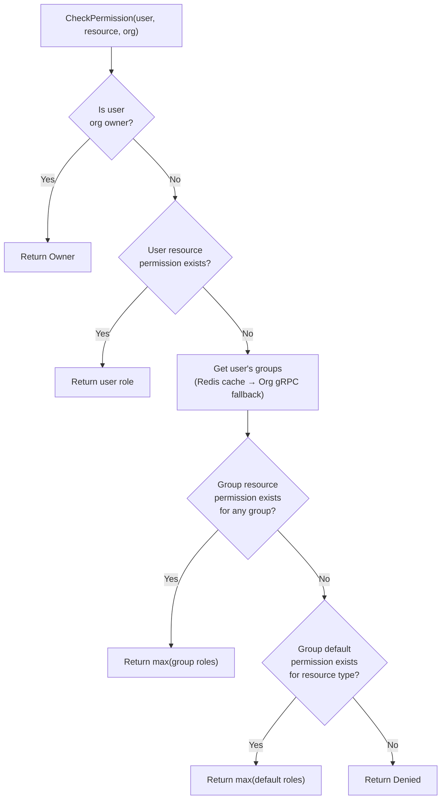
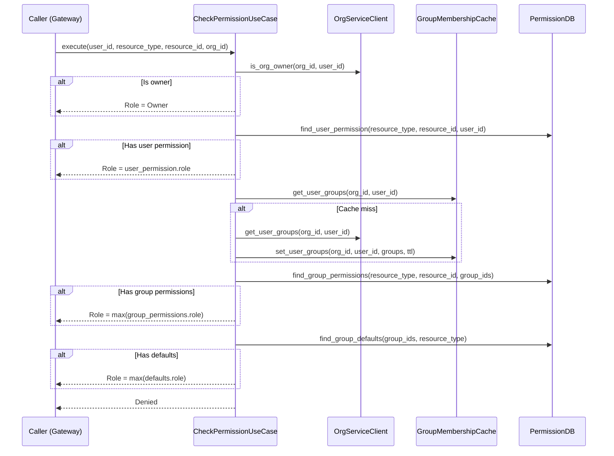
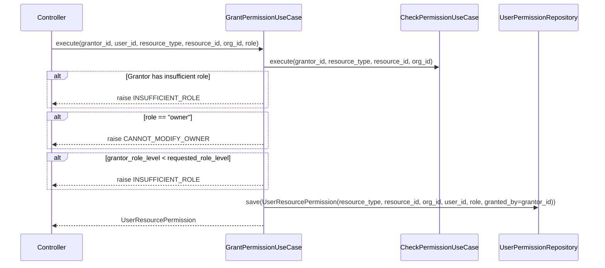
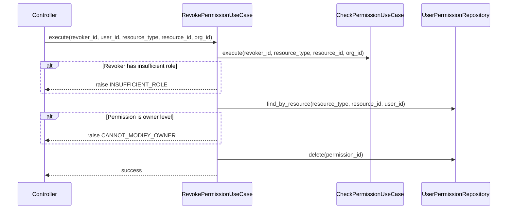
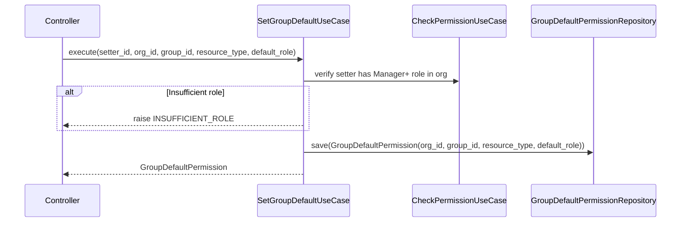
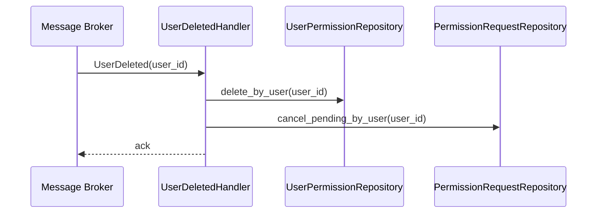

# Permission Service — Detailed Design

> **Cross-references:**
> - System architecture, inter-service communication, and security: [`docs/MSA-DESIGN.md`](../../../docs/MSA-DESIGN.md)
> - Cross-service data flows (permission check): [`docs/MSA-DESIGN.md` Section 5](../../../docs/MSA-DESIGN.md#5-cross-service-data-flows)
> - REST API endpoints and DTOs: [`gateway/docs/GATE_DESIGN.md`](../../../gateway/docs/GATE_DESIGN.md)
> - Auth Service (`UserDeleted` event source, user validation): [`services/auth/docs/AUTH_DESIGN.md`](../../auth/docs/AUTH_DESIGN.md)
> - Org Service (group membership resolution via gRPC, org owner check): [`services/organization/docs/ORGN_DESIGN.md`](../../organization/docs/ORGN_DESIGN.md)

## 1. Overview

The Permission Service manages resource-level authorization using a hybrid model: user-specific overrides layered on top of group-based defaults. It resolves effective permissions by consulting org ownership, user permissions, group permissions, and group defaults in priority order.

### Responsibilities

- Permission resolution (hybrid: user override > group resource > group default)
- Grant/revoke permissions on resources (user-level and group-level)
- Group default permission management
- Permission request/approval workflow (Phase 2, stubbed in MVP)
- Role hierarchy enforcement
- Cleanup on user deletion events

### Non-Responsibilities

- User authentication (Auth Service)
- Group/membership management (Organization Service)
- Resource existence validation (consuming services own their resources)

> **Implementation note:** All `UUID` types shown in port signatures and entity fields below are implemented as `str` (stringified UUIDs) in code. This simplifies serialization across gRPC boundaries and matches the convention used in Auth and Organization services.

---

## 2. Role Hierarchy


### Permission Matrix

| Action | Owner | Manager | Collaborator | Reviewer | Reader |
|---|---|---|---|---|---|
| Create | Y | Y | Y | - | - |
| Read | Y | Y | Y | Y | Y |
| Update | Y | Y | Y | - | - |
| Delete | Y | - | - | - | - |
| Add comments | Y | Y | Y | Y | - |
| Manage perms | Y (all) | Y (up to Manager) | Request only | - | - |

### Role Level Constants

```python
ROLE_LEVELS = {
    "reader": 1,
    "reviewer": 2,
    "collaborator": 3,
    "manager": 4,
    "owner": 5,
}
```

**Invariant:** A user can only grant roles at or below their own level (except `owner`, which cannot be granted via this service — it comes from org ownership).

---

## 3. Domain Entities

### UserResourcePermission

```python
@dataclass
class UserResourcePermission:
    id: UUID
    resource_type: str
    resource_id: str
    org_id: UUID
    user_id: UUID | None  # Nullable for future service accounts
    role: str  # owner|manager|collaborator|reviewer|reader
    granted_by: UUID
    created_at: datetime = field(default_factory=datetime.utcnow)
```

**Invariants:**
- `(resource_type, resource_id, user_id)` is unique
- `role` must be a valid role from the hierarchy

### GroupResourcePermission

```python
@dataclass
class GroupResourcePermission:
    id: UUID
    resource_type: str
    resource_id: str
    org_id: UUID
    group_id: UUID
    role: str
    granted_by: UUID
    created_at: datetime = field(default_factory=datetime.utcnow)
```

**Invariants:**
- `(resource_type, resource_id, group_id)` is unique
- Cascades through group hierarchy (parent group permission applies to sub-groups)

### GroupDefaultPermission

```python
@dataclass
class GroupDefaultPermission:
    id: UUID
    org_id: UUID
    group_id: UUID
    resource_type: str  # Applies to ALL resources of this type
    default_role: str
    created_at: datetime = field(default_factory=datetime.utcnow)
```

**Invariants:**
- `(group_id, resource_type)` is unique
- Acts as a fallback when no specific resource permission exists

### PermissionRequest (Phase 2, stubbed)

```python
@dataclass
class PermissionRequest:
    id: UUID
    resource_type: str
    resource_id: str
    requester_id: UUID
    requested_role: str
    status: str  # pending|approved|rejected
    reviewed_by: UUID | None
    created_at: datetime = field(default_factory=datetime.utcnow)
    updated_at: datetime = field(default_factory=datetime.utcnow)
```

---

## 4. Permission Resolution Algorithm

> **Cross-service flow:** See [`docs/MSA-DESIGN.md` Section 5.2](../../../docs/MSA-DESIGN.md#52-check-permission-on-a-resource) for the full Gateway → Permission → Org → Redis flow.



### Resolution Details

**Step 1 — Org Owner Check:**
- Call `OrgService.IsOrgOwner(org_id, user_id)` via gRPC (see [Org Service gRPC definition](../../organization/docs/ORGN_DESIGN.md#8-grpc-service-definition))
- If true, return `Owner` immediately

**Step 2 — User Resource Permission:**
- Query `user_resource_permissions` for `(resource_type, resource_id, user_id)`
- If found, return the role

**Step 3 — Group Resource Permission:**
- Get user's groups from Redis cache; on cache miss, call `OrgService.GetUserGroups(org_id, user_id)` and cache result (see [Org Service caching strategy](../../organization/docs/ORGN_DESIGN.md#9-caching-strategy))
- For each group, also consider ancestor groups (group hierarchy cascades)
- Query `group_resource_permissions` for `(resource_type, resource_id, [group_ids])`
- If any found, return the highest role

**Step 4 — Group Default Permission:**
- Using same group list from step 3
- Query `group_default_permissions` for `([group_ids], resource_type)`
- If any found, return the highest role

**Step 5 — Denied:**
- No permission found, return `Denied`

---

## 5. Use Case Details

### 5.1 CheckPermission



### 5.2 GrantPermission



### 5.3 RevokePermission



### 5.4 SetGroupDefault



### 5.5 HandleUserDeleted

> **Cross-service flow:** See [`docs/MSA-DESIGN.md` Section 5.4](../../../docs/MSA-DESIGN.md#54-user-deletion-event-driven-cleanup) for the full event-driven cleanup across Auth, Org, and Permission services.



---

## 6. Ports (Interfaces)

### Outbound Ports

```python
class UserPermissionRepository(Protocol):
    async def find_by_resource(self, resource_type: str, resource_id: str, user_id: UUID) -> UserResourcePermission | None: ...
    async def find_all_by_resource(self, resource_type: str, resource_id: str) -> list[UserResourcePermission]: ...
    async def find_all_by_user(self, user_id: UUID) -> list[UserResourcePermission]: ...
    async def save(self, permission: UserResourcePermission) -> UserResourcePermission: ...
    async def delete(self, permission_id: UUID) -> None: ...
    async def delete_by_user(self, user_id: UUID) -> int: ...

class GroupPermissionRepository(Protocol):
    async def find_by_resource(self, resource_type: str, resource_id: str, group_id: UUID) -> GroupResourcePermission | None: ...
    async def find_by_resource_for_groups(self, resource_type: str, resource_id: str, group_ids: list[UUID]) -> list[GroupResourcePermission]: ...
    async def find_all_by_resource(self, resource_type: str, resource_id: str) -> list[GroupResourcePermission]: ...
    async def save(self, permission: GroupResourcePermission) -> GroupResourcePermission: ...
    async def delete(self, permission_id: UUID) -> None: ...

class GroupDefaultPermissionRepository(Protocol):
    async def find_group_defaults(self, group_ids: list[UUID], resource_type: str) -> list[GroupDefaultPermission]: ...
    async def save(self, default: GroupDefaultPermission) -> GroupDefaultPermission: ...
    async def delete(self, default_id: UUID) -> None: ...

class PermissionRequestRepository(Protocol):
    async def save(self, request: PermissionRequest) -> PermissionRequest: ...
    async def find_by_id(self, request_id: UUID) -> PermissionRequest | None: ...
    async def find_pending_by_resource(self, resource_type: str, resource_id: str) -> list[PermissionRequest]: ...
    async def cancel_pending_by_user(self, user_id: UUID) -> int: ...

class OrgServiceClient(Protocol):
    """Calls Org Service gRPC. See org gRPC definition in services/organization/docs/ORGN_DESIGN.md."""
    async def get_user_groups(self, org_id: UUID, user_id: UUID) -> list[GroupInfo]: ...
    async def is_org_owner(self, org_id: UUID, user_id: UUID) -> bool: ...

class AuthServiceClient(Protocol):
    """Calls Auth Service gRPC. See auth gRPC definition in services/auth/docs/AUTH_DESIGN.md."""
    async def get_user(self, user_id: UUID) -> UserInfo | None: ...

class GroupMembershipCache(Protocol):
    """Consumes cache populated by Org Service. See services/organization/docs/ORGN_DESIGN.md Section 9."""
    async def get_user_groups(self, org_id: UUID, user_id: UUID) -> list[GroupInfo] | None: ...
    async def set_user_groups(self, org_id: UUID, user_id: UUID, groups: list[GroupInfo], ttl: int) -> None: ...

class EventSubscriber(Protocol):
    async def on_user_deleted(self, user_id: UUID) -> None: ...
```

### Inbound Ports

```python
class CheckPermissionUseCase(Protocol):
    async def execute(self, user_id: UUID, resource_type: str, resource_id: str, org_id: UUID) -> PermissionResult: ...

class GrantPermissionUseCase(Protocol):
    async def execute(self, grantor_id: UUID, user_id: UUID, resource_type: str, resource_id: str, org_id: UUID, role: str) -> UserResourcePermission: ...

class RevokePermissionUseCase(Protocol):
    async def execute(self, revoker_id: UUID, user_id: UUID, resource_type: str, resource_id: str, org_id: UUID) -> None: ...

class SetGroupDefaultUseCase(Protocol):
    async def execute(self, setter_id: UUID, org_id: UUID, group_id: UUID, resource_type: str, default_role: str) -> GroupDefaultPermission: ...

class ListResourcePermissionsUseCase(Protocol):
    async def execute(self, resource_type: str, resource_id: str, org_id: UUID) -> ResourcePermissions: ...

class ListUserPermissionsUseCase(Protocol):
    async def execute(self, user_id: UUID, org_id: UUID) -> list[UserResourcePermission]: ...

class RequestPermissionUseCase(Protocol):
    async def execute(self, requester_id: UUID, resource_type: str, resource_id: str, requested_role: str) -> PermissionRequest: ...

class ApprovePermissionRequestUseCase(Protocol):
    async def execute(self, reviewer_id: UUID, request_id: UUID) -> UserResourcePermission: ...
```

---

## 7. Database Schema

```sql
CREATE TABLE user_resource_permissions (
    id UUID PRIMARY KEY DEFAULT gen_random_uuid(),
    resource_type VARCHAR(100) NOT NULL,
    resource_id VARCHAR(255) NOT NULL,
    org_id UUID NOT NULL,
    user_id UUID,
    role VARCHAR(20) NOT NULL CHECK (role IN ('owner', 'manager', 'collaborator', 'reviewer', 'reader')),
    granted_by UUID NOT NULL,
    created_at TIMESTAMPTZ DEFAULT now(),
    UNIQUE(resource_type, resource_id, user_id)
);
CREATE INDEX idx_user_perm_resource ON user_resource_permissions(resource_type, resource_id);
CREATE INDEX idx_user_perm_user ON user_resource_permissions(user_id);

CREATE TABLE group_resource_permissions (
    id UUID PRIMARY KEY DEFAULT gen_random_uuid(),
    resource_type VARCHAR(100) NOT NULL,
    resource_id VARCHAR(255) NOT NULL,
    org_id UUID NOT NULL,
    group_id UUID NOT NULL,
    role VARCHAR(20) NOT NULL CHECK (role IN ('owner', 'manager', 'collaborator', 'reviewer', 'reader')),
    granted_by UUID NOT NULL,
    created_at TIMESTAMPTZ DEFAULT now(),
    UNIQUE(resource_type, resource_id, group_id)
);
CREATE INDEX idx_group_perm_resource ON group_resource_permissions(resource_type, resource_id);
CREATE INDEX idx_group_perm_group ON group_resource_permissions(group_id);

CREATE TABLE group_default_permissions (
    id UUID PRIMARY KEY DEFAULT gen_random_uuid(),
    org_id UUID NOT NULL,
    group_id UUID NOT NULL,
    resource_type VARCHAR(100) NOT NULL,
    default_role VARCHAR(20) NOT NULL CHECK (default_role IN ('owner', 'manager', 'collaborator', 'reviewer', 'reader')),
    created_at TIMESTAMPTZ DEFAULT now(),
    UNIQUE(group_id, resource_type)
);

CREATE TABLE permission_requests (
    id UUID PRIMARY KEY DEFAULT gen_random_uuid(),
    resource_type VARCHAR(100) NOT NULL,
    resource_id VARCHAR(255) NOT NULL,
    requester_id UUID NOT NULL,
    requested_role VARCHAR(20) NOT NULL,
    status VARCHAR(20) DEFAULT 'pending' CHECK (status IN ('pending', 'approved', 'rejected')),
    reviewed_by UUID,
    created_at TIMESTAMPTZ DEFAULT now(),
    updated_at TIMESTAMPTZ DEFAULT now()
);
```

---

## 8. Error Handling

### Domain Errors

```python
class PermError(Enum):
    PERMISSION_DENIED = "permission_denied"
    INSUFFICIENT_ROLE = "insufficient_role"
    RESOURCE_NOT_FOUND = "resource_not_found"
    CANNOT_MODIFY_OWNER = "cannot_modify_owner"
    UPSTREAM_UNAVAILABLE = "upstream_unavailable"
    PERMISSION_NOT_FOUND = "permission_not_found"
    REQUEST_NOT_FOUND = "request_not_found"
    REQUEST_ALREADY_REVIEWED = "request_already_reviewed"
```

### Error Translation

| Domain Error | gRPC Status | HTTP Status |
|---|---|---|
| `PERMISSION_DENIED` | `PERMISSION_DENIED` | 403 |
| `INSUFFICIENT_ROLE` | `PERMISSION_DENIED` | 403 |
| `RESOURCE_NOT_FOUND` | `NOT_FOUND` | 404 |
| `CANNOT_MODIFY_OWNER` | `FAILED_PRECONDITION` | 409 |
| `UPSTREAM_UNAVAILABLE` | `UNAVAILABLE` | 503 |
| `PERMISSION_NOT_FOUND` | `NOT_FOUND` | 404 |
| `REQUEST_NOT_FOUND` | `NOT_FOUND` | 404 |
| `REQUEST_ALREADY_REVIEWED` | `FAILED_PRECONDITION` | 409 |

---

## 9. gRPC Service Definition

```protobuf
syntax = "proto3";
package permission.v1;

service PermissionService {
  rpc CheckPermission(CheckPermissionRequest) returns (CheckPermissionResponse);
  rpc GrantPermission(GrantPermissionRequest) returns (GrantPermissionResponse);
  rpc RevokePermission(RevokePermissionRequest) returns (RevokePermissionResponse);
  rpc SetGroupDefault(SetGroupDefaultRequest) returns (SetGroupDefaultResponse);
  rpc ListResourcePermissions(ListResourcePermissionsRequest) returns (ListResourcePermissionsResponse);
  rpc ListUserPermissions(ListUserPermissionsRequest) returns (ListUserPermissionsResponse);
  rpc RequestPermission(RequestPermissionRequest) returns (RequestPermissionResponse);
  rpc ApprovePermissionRequest(ApprovePermissionRequestRequest) returns (ApprovePermissionRequestResponse);
}

message CheckPermissionRequest {
  string user_id = 1;
  string resource_type = 2;
  string resource_id = 3;
  string org_id = 4;
}

message CheckPermissionResponse {
  bool allowed = 1;
  string role = 2;  // Effective role, empty if denied
  string resolution_source = 3;  // "org_owner" | "user_permission" | "group_permission" | "group_default"
}

message GrantPermissionRequest {
  string grantor_id = 1;
  string user_id = 2;
  string resource_type = 3;
  string resource_id = 4;
  string org_id = 5;
  string role = 6;
}

message GrantPermissionResponse {
  string permission_id = 1;
}

message RevokePermissionRequest {
  string revoker_id = 1;
  string user_id = 2;
  string resource_type = 3;
  string resource_id = 4;
  string org_id = 5;
}

message RevokePermissionResponse {}

message SetGroupDefaultRequest {
  string setter_id = 1;
  string org_id = 2;
  string group_id = 3;
  string resource_type = 4;
  string default_role = 5;
}

message SetGroupDefaultResponse {
  string default_id = 1;
}

message ListResourcePermissionsRequest {
  string resource_type = 1;
  string resource_id = 2;
  string org_id = 3;
}

message ListResourcePermissionsResponse {
  repeated PermissionEntry user_permissions = 1;
  repeated GroupPermissionEntry group_permissions = 2;
  repeated GroupDefaultEntry group_defaults = 3;
}

message PermissionEntry {
  string user_id = 1;
  string role = 2;
  string granted_by = 3;
}

message GroupPermissionEntry {
  string group_id = 1;
  string role = 2;
  string granted_by = 3;
}

message GroupDefaultEntry {
  string group_id = 1;
  string default_role = 2;
}

message ListUserPermissionsRequest {
  string user_id = 1;
  string org_id = 2;
}

message ListUserPermissionsResponse {
  repeated UserPermissionEntry permissions = 1;
}

message UserPermissionEntry {
  string resource_type = 1;
  string resource_id = 2;
  string role = 3;
  string source = 4;  // "direct" | "group" | "default"
}

message RequestPermissionRequest {
  string requester_id = 1;
  string resource_type = 2;
  string resource_id = 3;
  string requested_role = 4;
}

message RequestPermissionResponse {
  string request_id = 1;
  string status = 2;
}

message ApprovePermissionRequestRequest {
  string reviewer_id = 1;
  string request_id = 2;
}

message ApprovePermissionRequestResponse {
  string permission_id = 1;
}
```

---

## 10. Resilience: Org Service Dependency

The Permission Service depends on the Org Service for group membership data. To handle Org Service unavailability:

- **Redis cache**: Group membership is cached with TTL (5 min default)
- **Cache-first**: Always check Redis before calling Org Service gRPC
- **Stale-on-error**: If Org Service is unreachable and cache has expired, use stale cache data with a warning log
- **Hard failure**: If no cached data exists and Org Service is unreachable, return `UPSTREAM_UNAVAILABLE`

---

## 11. Future Extensions

### Activity API (Phase 2)

An activity feed tracking permission changes (grants, revocations, checks). Required by the frontend permissions overview page.

- **Endpoint**: `GET /permissions/activity?org_id=<id>&limit=<n>`
- **Events to track**: grant, revoke, check (denied only), group default changes
- **Storage**: Append-only `permission_activity` table with columns: `id`, `org_id`, `actor_id`, `action` (grant/revoke/check/set_default), `resource_type`, `resource_id`, `target_id` (user or group), `role`, `created_at`
- **Scope**: Returns activity for orgs the caller is a member of
- **Retention**: TBD (consider TTL or partition pruning for large deployments)
